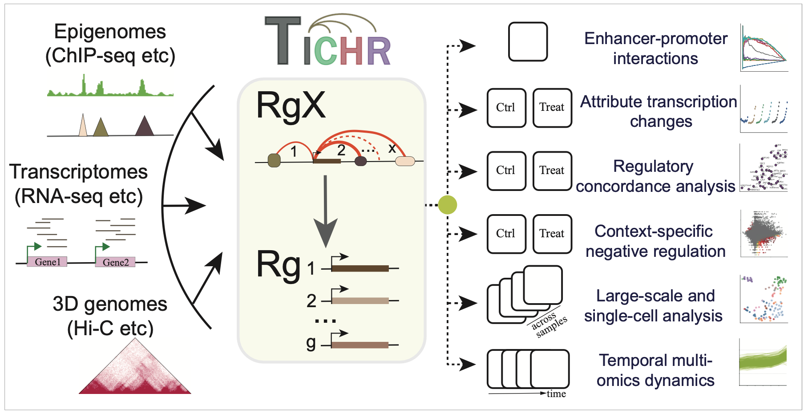
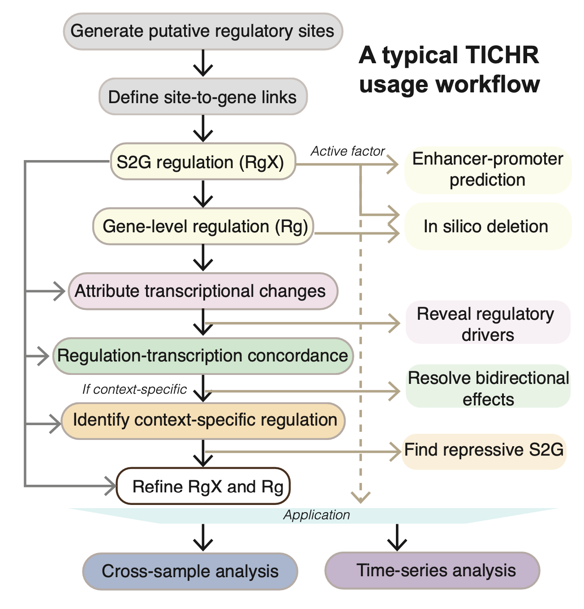

# Introduction TICHR

<div style="padding: 15px; border: 1px solid transparent; border-color: transparent; margin-bottom: 20px; border-radius: 4px; color: #8a6d3b;; background-color: #fcf8e3; border-color: #faebcc;">
<b>TICHR is currently under development. This page is intended for internal or developer use only. A public release will be available soon. Thank you.</b>
</div>


## What is TICHR


Understanding transcriptional regulation across multiple omics layers is essential for elucidating cellular functions and the molecular basis of human diseases. However, the integration of multi-omics data remains challenging due to the lack of direct correspondences between different data types. To address this, we developed TICHR, a computational tool designed to investigate transcriptional regulation by integrating epigenomic (e.g., ChIP-seq), 3D genome (e.g., Hi-C), and transcriptomic (e.g., RNA-seq) data. TICHR quantifies the regulatory potential of genomic loci on target genes by modeling epigenetic modifications and chromatin architecture. It then evaluates the transcriptional consequences of these regulatory interactions using gene expression data, enabling genome-wide inference of locus–gene relationships and their regulatory strength.

This diagram outlines all the functions of Tichr:



-----

## Install TICHR

TICHR is developed based on Python 3.11.5. In theory, any Python version newer than 3.11.5 should be compatible. However, if you encounter any issues, we recommend creating an isolated environment with Python 3.11.5 using Conda.

### Requirement

Python packages:

-   numpy
-   pandas
-   scipy
-   matplotlib
-   seaborn
-   pyBigWig
-   scikit-learn
-   hic-straw
-   statsmodels
-   pyranges
-   tqdm
-   adjustText
-   umap-learn

Optional

- rpy2
- joblib
- multiprocessing

### Install

You can install the latest version of TICHR <u>from PyPI using pip</u>:

``` shell
pip install tichr
```

Alternatively, you can install TICHR from the <u>source code</u> on GitHub:

``` shell
git clone https://github.com/wangjk321/Tichr
cd Tichr
python setup.py install
```

### Usage

There are two ways to use TICHR

1. **Command Line Interface (CLI)** — This is the most straightforward method for most users. After installation, you can check the available commands with:

``` shell
tichr --help
```

2. **Python Module** — Advanced users can import TICHR as a Python package and use its functions programmatically. For example:

``` python
import sys
sys.path.append('/home/wang/github/Tichr-CLI/tichr')
from tichr import *
```

### Workflow

Here is a **typical workflow** for analysis using Tichr. You can find detailed usage instructions for them in the following chapters.

