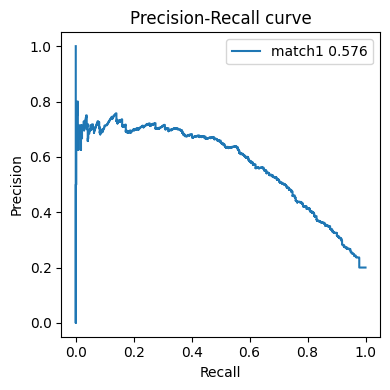
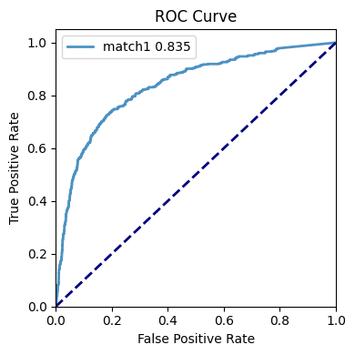
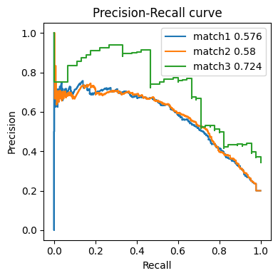
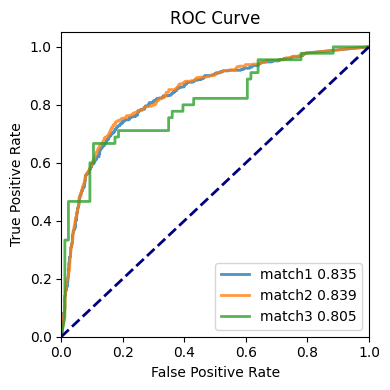
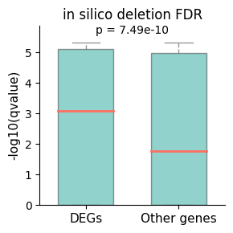

# 3. Accurate enhancer representation

The **Tichr** `siteToGene`module can be used to **characterizing enhancer-promoter interactions** based on `RgX` results. 

<div style="padding: 15px; border: 1px solid transparent; border-color: transparent; margin-bottom: 20px; border-radius: 10px; color: #000000ff;; background-color: #b5cabaff; border-color: #faebcc;">
<section class="note important">
  <p><strong>Important:</strong></p>
  <p>
    When analyzing active factors such as <strong>H3K27ac</strong>, it is appropriate to refer to the elements as
    <em>“enhancers”</em> and their connections as <em>“E–P interactions.”</em>
  </p>
  <p>
    In other contexts, it is more accurate to describe them as <em>“regulatory sites”</em> and
    <em>“S2G (site-to-gene) links.”</em>
  </p>
</section>
</div>

## 1. Normalize RgX values

#### Description

We developed a standardized RgX metric (**normRgX**) to enable consistent enhancer–promoter (E–P) identification across multiple datasets. 
- Unlike the ABC method, which applied a K562-derived cutoff of 0.02 without offering a generalizable threshold,
- **normRgX** produced consistent density distributions across nine datasets. 
- Systematic threshold scanning showed that **normRgX = 1** provides the best balance between recall and precision, both reaching approximately 0.5. 
- Correspondingly, the F1 score also peaked near **normRgX = 1** , supporting this value as the optimal cutoff.

#### Code

``` python
from tichr.siteToGene import *
rgxfile="test_RgxDf.tsv"
rgfile="test_RgDf.tsv"
f = postTichr("test_RgxDf.tsv", "test_RgDf.tsv", header=False)
f.norm(new_colname="normRgX", outname="test")
```

#### Output

This step generates the normalized **RgX**:
- A new attribute, `f.normdf`, will be created. 
``` python
print(f.normdf)
```
- The normalized values are automatically saved as TSV files containing **normRgX**.
- The last column of these TSV files contains **normRgX**.
- The output also includes a standard RgX file (see [What is rgdf and rgxdf?](1.Compute.md#what-is-rgdf-and-rgxdf)).


``` text
***normRgX generated.
0  chr1  3774714  3775214  46497.0  ARHGEF16  chr1  3454664  3481113  +   
1  chr1  3774714  3775214  46497.0     MEGF6  chr1  3487950  3611508  -   
2  chr1  3774714  3775214  46497.0    TPRG1L  chr1  3625014  3630127  +   
3  chr1  3774714  3775214  46497.0    WRAP73  chr1  3630769  3650103  -   
4  chr1  3774714  3775214  46497.0      TP73  chr1  3652515  3736201  +   


0  ENSG00000130762  329.911255  1.533988e+07  1.0  1.262273  
1  ENSG00000162591  545.929138  2.538407e+07  1.0  1.728830  
2  ENSG00000158109  545.929138  2.538407e+07  1.0  1.728830  
3  ENSG00000116213  729.483582  3.391880e+07  1.0  2.033092  
4  ENSG00000078900  729.483582  3.391880e+07  1.0  2.033092  
***Saved to test_normRgX.tsv.gz
```

<div style="padding: 15px; border: 1px solid transparent; border-color: transparent; margin-bottom: 20px; border-radius: 10px; color: #000000ff;; background-color: #b5cabaff; border-color: #faebcc;">
You can then select site–gene links with <b>normRgX > 1</b> as enhancers (or regulatory sites).
</div>


## 2.Identify regulatory sites or target genes

#### A typical workflow

Highly enriched S2G links (e.g., E–P interactions) can be identified through the following steps:

- **Calculate RgX** using multi-omics data. See [here](1.Compute.md).
- **Adjust RgX** by raw values (default), gene TPM (optional), and chromatin structure (optional). See [here](1.Compute.md#adjust-for-rgx-and-rg).
- **Filter results** by maximum distance and noise. See [here](1.Compute.md#filter-regulations).
- **Normalize RgX** to obtain **normRgX**. See [here](#1-normalize-rgx-values).
- Select links with **normRgX > 1** as enriched E–P interactions.  
  Additionally, you may further filter using **RgX_ratio** or **RgX_raw** if needed.

``` shell
$ zcat test_normRgX.tsv.gz | wc -l
# For example, 24830 site-to-gene links.
# Then we can select the rows with norm RgX>1.

$ zcat test_normRgX.tsv.gz |sed '1d'| awk '$14>1' |cut -f 1-13 > test_EP.tsv
$ cat test_EP.tsv |wc -l
# The final EP outputs contains 4166 rows which represent 4166 identified EP pairs.
```

#### Identify regulatory sites

- The user provides a **gene set** as input.  
- Genes are matched against the final site–gene pairs (e.g., `test_EP.tsv`) using their gene IDs.  
- The corresponding regulatory sites or enhancers are returned for the input gene set.

#### Identify target genes

- The user provides a **set of sites** (e.g., in BED3 format) as input.  
- Target genes are identified from the final site–gene pairs (e.g., `test_EP.tsv`) using `intersectBed`.  
- The corresponding target genes are returned for the input sites.


## 3.Evaluate enhancer prediction

To predict enhancer–promoter (E–P) interactions, 
- A “gold” or ground-truth dataset is required for benchmarking the **RgX** results.  
- You can use promoter-capture Hi-C or other related experimental data to obtain this reference.
- We will use a set of sample data to demonstrate how to perform E–P prediction analysis using the **Tichr** `siteToGene` module.

#### Prepare ground truth

``` python
# Ground truth
datadir = "./Data/SiteToGene"
golddf = f"{datadir}/K562_gold_label.tsv"
goldGeneCol = 10
goldLabelCol = 12 # 1-based
goldHead = False
```

**`golddf` is a data table (`.tsv`) containing the gold-standard E–P pairs.**

It must follow the structure below (column titles are optional):

- **1st column:** site chromosome  
- **2nd column:** site start  
- **3rd column:** site end  
- **`goldGeneCol`:** Column index (1-based) of the gene ID in `golddf`; this gene ID must match the RgX gene ID.  
- **`goldLabelCol`:** Column index (1-based) indicating whether the site–gene pair is a true interaction (`True/False` or `1/0`).  
- **`goldHead`:** Whether the file contains a header line.

Here is an example file:

| peakChr | peakStart | peakEnd   | peakID       | peakType      | geneChr | geneStart | geneEnd   | transcriptID      | geneID          | geneStrand | weight |
| ------- | --------- | --------- | ------------ | ------------- | ------- | --------- | --------- | ----------------- | --------------- | ---------- | ------ |
| chr7    | 100694352 | 100694774 | EH37E0917456 | Enhancer-like | chr7    | 100689448 | 100689448 | ENST00000275732.5 | ENSG00000146830 | -          | 1      |
| chr7    | 100694352 | 100694774 | EH37E0917456 | Enhancer-like | chr7    | 100351256 | 100351256 | ENST00000472646.1 | ENSG00000272752 | +          | 0      |
| chr7    | 100694352 | 100694774 | EH37E0917456 | Enhancer-like | chr7    | 100656461 | 100656461 | ENST00000160382.5 | ENSG00000077080 | -          | 0      |

#### Prepare Rgx file

``` python
# input RgX
rgxfile = f"{datadir}/K562_RgxDF.tsv"
predGeneCol = 10
predScoreCol = 12
```

- The RgX file is generated using the core `tichr` module (see [here](1.Compute.md)).
- **predGeneCol**: The 1-based column index for the gene ID in the RgX file. If unchanged, this is typically **10**.
- **predScoreCol**: The 1-based column index for the RgX value in the RgX file. If unchanged, this is typically **12**.

An example RgX-formatted file is shown below:


| peakChr | peakStart | peakEnd  | epigenomeActivity   | geneSymbol        | geneChr | geneStart | geneEnd  | geneStrand | geneID             | weight | Rgx_rawvalue | Rgx_percent |
| ------- | --------- | -------- | ------------------- | ----------------- | ------- | --------- | -------- | ---------- | ------------------ | ------ | ------------ | ----------- |
| chr1    | 20290552  | 20291052 | 0.26389441413565384 | ENST00000568195.1 | chr1    | 25272548  | 25272548 | +          | ENSG00000187010.14 | 0.0    | 0.0          | 0.0         |
| chr1    | 20308450  | 20308950 | 0.24814898809465255 | ENST00000568195.1 | chr1    | 25272548  | 25272548 | +          | ENSG00000187010.14 | 0.0    | 0.0          | 0.0         |
| chr1    | 20328146  | 20328646 | 0.2605078694176051  | ENST00000568195.1 | chr1    | 25272548  | 25272548 | +          | ENSG00000187010.14 | 0.0    | 0.0          | 0.0         |

#### Match Rgx to ground-truth

You can use the `matchgold` function to match Rgx with the gold standard E-P pairs in golddf. Here is an exammple:

``` python
from tichr.siteToGene import *

outname = "test_matched.tsv" #Output

matchedS2g = matchgold(rgxfile,golddf,outname,
                       goldGeneCol,goldHead=goldHead,
                       predGeneCol=predGeneCol,predScoreCol=predScoreCol,
                       returnDF=True,)
```

- The code above will generate a new file **`test_matched.tsv`**, which contains the original gold-standard data plus an additional column with the matched score derived from the RgX file.
- If `returnDF` is set to `True`, the function will also return a pandas DataFrame containing the same content as `test_matched.tsv`.


#### Visualize performance

If you want to visualize the matching results, **Tichr** provides APIs to plot PRC and ROC curves.

**PRC**  
The Precision–Recall Curve illustrates the performance of the **Tichr** `siteToGene` module in predicting E–P pairs against a user-provided gold-standard E–P dataset.

The `showPRC` function accepts four parameters:

- A list (or `np.array`) representing the ground-truth labels (`0/1` or `True/False`).
- A list (or `np.array`) of equal length containing the prediction scores (e.g., matched RgX values).
- A label for the prediction.

A general usage example:
``` python
from tichr.siteToGene import *
showPRC(truth_list, score_list,"label1")
```

Used for predicting enhancers. It will also provide the AUPRC value.
``` python
showPRC(matchedS2g[goldLabelCol-1],matchedS2g.iloc[:,-1],"match1",outname="match1_auprc.pdf")
```



**ROC**

Similar, we can generate the ROC curve and AUROC value:

A general usage example:
``` python
from tichr.siteToGene import *
showROC(truth_list, score_list,"label1")
```

Used for predicting enhancers.
``` python
showROC(matchedS2g[goldLabelCol-1],matchedS2g.iloc[:,-1],"match1",outname="match1_roc.pdf")
```




**Customize plot**  
If desired, you can customize colors, titles, and many other plotting parameters.

Here is an example:

``` python
#PRC
plt.title("test title")
pltoneprc(matchedS2g[goldLabelCol-1],matchedS2g.iloc[:,-1],"match1","green")
plt.show()
#ROC
pltoneroc(matchedS2g[goldLabelCol-1],matchedS2g.iloc[:,-1],"match1","green")
plt.show()
```

#### Visualize multiple curves

Tichr also supports plotting PRC or ROC curves for multiple RgX predictions simultaneously.  
Here is an example:

``` python
matched2 = matchgold(f"{datadir}/K562_RgxDF_type2.tsv",golddf,outname,goldGeneCol,
                     goldHead=goldHead,returnDF=True)

matched3 = matchgold(f"{datadir}/K562_RgxDF_type3.tsv",golddf,outname,goldGeneCol,
                     goldHead=goldHead,returnDF=True)

showPRC(matchedS2g[goldLabelCol-1],matchedS2g.iloc[:,-1],"data1",
         matched2[goldLabelCol-1],matched2.iloc[:,-1],"data2",
         matched3[goldLabelCol-1],matched3.iloc[:,-1],"data3",
         outname="3match_auprc.pdf")
```



``` python
showROC(matchedS2g[goldLabelCol-1],matchedS2g.iloc[:,-1],"data1",
         matched2[goldLabelCol-1],matched2.iloc[:,-1],"data2",
         matched3[goldLabelCol-1],matched3.iloc[:,-1],"data3",
         outname="3match_auroc.pdf")
```




## 4. Stratify S2G properties

- It is worth noting that E–P prediction was influenced by S2G properties. 

- The **`diffrentThresh`** function can be used to view PRC under different thresholds, 

- which helps in finding suitable parameters for Tichr.

prepare files
``` python 
from tichr.siteToGene import *

dataDir = "./Data/SiteToGene/"
outDir = "diffdistance/"

rgxfile= f"{dataDir}/K562_RgxDF.tsv"
rgfile= f"{dataDir}/K562_RgDF.tsv"

golddf= f"{dataDir}/K562_gold_label.tsv"
goldGeneCol = 10
goldLabelCol = 12 # 1-based
goldHead = False

tpmDir=f"{dataDir}/K562.genes.TPM.txt"
tmpCols=[3,4,]  # TPM values for multiple replicates across columns (1-based)
tmpGeneID=2  #Column number for gene ID (1-based)
```

#### By different distance

You can set `threshType` as `distance` to Predict EP by different distance. Here is an example:

``` python

diffrentThresh(rgxfile,rgfile,golddf,goldGeneCol,outDir,tpmDir,
               goldLabelCol=goldLabelCol,goldHead=goldHead,
                threshType="distance",threshList=[10000,50000,100000,500000,1000000,5000000],
                tmpCols=tmpCols,tmpGeneID=tmpGeneID,)
```


#### By different gene TPM

Similarly, you can also set `threshType`to "tpm" to predict EP based on different gene TPM values:

``` python
diffrentThresh(rgxfile,rgfile,golddf,goldGeneCol,outDir,tpmDir,
               goldLabelCol=goldLabelCol,goldHead=goldHead,
                threshType="tpm",threshList=[0.0,0.2,0.4,0.6,0.8,0.9],
                tmpCols=tmpCols,tmpGeneID=tmpGeneID,)
```


#### By concordance between Rg and TPM 

You can also evaluate prediction performance using the **"sumrank"** method, which reflects the concordance between Rg and TPM.

``` python
diffrentThresh(rgxfile,rgfile,golddf,goldGeneCol,outDir,tpmDir,
               goldLabelCol=goldLabelCol,goldHead=goldHead,
               threshType="sumrank",threshList=[0.0,0.2,0.4,0.6,0.8,0.9],
                tmpCols=tmpCols,tmpGeneID=tmpGeneID,)ot=False)
```


#### Check RgX distribution

The `plotdensity`function can help you to check the distribution of RgX

``` python
plotdensity(rgxfile,outDir,matchedwithhead = goldHead,matchcol=goldGeneCol,truecol=goldLabelCol)
```


## 5. In silico deletion analysis

#### Description
To assess the regulatory influence of specific regions, an *in silico* deletion analysis was developed:

1. **Delete S2G signals:**  
   The RgX values of all S2G pairs associated with the queried regions were set to zero.

2. **Compute gene-level changes:**  
   Gene-level Rg differences were calculated by comparing the original Rg values with those after deletion.

3. **Generate background controls:**  
   Differences obtained from the real deletion were compared with those from randomly deleted regions.

4. **Statistical testing:**  
   Wilcoxon tests were applied, followed by Benjamini–Hochberg correction.

5. **Identify affected genes:**  
   Genes with adjusted **p < 0.05** were considered simulated DEGs, representing putative targets of the queried regions.

You can achieve it through the function `silico`:

``` python
from tichr.insilico import *
```

#### Prepare input
Prepare input files:

``` python
datadir = "./Data/SiteToGene/"

RgDF = pd.read_csv(f"{datadir}/JQ1minus_BRD4_rep0_RP_RgDf.tsv",header=None,sep="\t")
RgxDF = pd.read_csv(f"{datadir}/JQ1minus_BRD4_rep0_RP_RgxDf.tsv",header=None,sep="\t")

deletepeakfile = f"{datadir}/BRD4.jq1lost.peak"
deletepeakDF=pd.read_csv(deletepeakfile,sep="\t",header=None)
```

- `RgDF_Ctrl`: Rg file 
- `RgxDF_Ctrl`: RgX file
- `deletepeakfile`: insilico deletion file


#### Run

``` python
outdf = silico(RgxDF,deletepeakDF,nrandom=100)
```

The output table provides the permutation-based significance for each gene after the in silico deletion analysis.
Each row corresponds to one gene, and the columns include:

- geneID — Gene identifier

- pvalue — Empirical p-value calculated from permutation tests

- FDR — Benjamini–Hochberg adjusted p-value

``` text
geneID              pvalue          FDR
ENSG00000002016     1.076353e-15    2.385431e-15
ENSG00000003056     6.020675e-15    1.260781e-14
ENSG00000003137     1.948280e-18    8.782952e-18
ENSG00000003393     1.137602e-05    1.795728e-05
ENSG00000003402     9.435245e-01    1.000000e+00
...
ENSG00000286239     1.624161e-03    2.409945e-03
ENSG00000286905     8.500628e-07    1.375283e-06
ENSG00000288623     1.171483e-03    1.743238e-03
ENSG00000288710     9.992291e-01    1.000000e+00
ENSG00000289685     1.948280e-18    8.782952e-18
```


#### Validate in silico deletion results with true knockdown data

To validate the in silico deletion results, you can provide a true knockdown or perturbation DEG table.

- For example, we test the **BRD4 peaks lost after JQ1 treatment** and examine whether the genes affected by in silico deletion are indeed true DEGs.
- A typical DEG table (e.g., obtained from RNA-seq using *edgeR*) should follow this structure:
  - **Column 4**: gene ID  
  - **Column 7**: gene expression logFC  
  - **Column 8**: gene expression FDR  

By comparing simulated affected genes with true DEGs, you can evaluate whether the deleted regulatory regions are truly associated with gene expression changes.


``` python
degDF = pd.read_csv(f"{datadir}/JQ1minus_BRD4_rep0_RP_RgDf.tsv",header=None,sep="\t")
silico(RgxDF,deletepeakDF,degDF=degDF,degtype="down",degfdr=0.01,nrandom=20,)
```




## 6 Evaluate adjustment

If you have a ground truth dataset of enhancer-promoter interactions, you can evaluate and compare the effectiveness of different adjustment methods using these reference interactions.

#### Prepare gold df

``` python
from tichr.siteToGene import *

golddf ="./Data/Calculate/Fulco_interactions_wScore.txt"
goldwithhead=True
goldcol=4  
truecol=5
matchcol=14
```

`golddf` is a ground-truth dataset of enhancer–promoter interactions.  
It must follow the structure below:

- **site chr**  
- **site start**  
- **site end**  
- **target gene(s)** for this site, recorded as gene IDs  
  (column assigned by `goldcol`, 1-based)  
- **True/False label** indicating whether this site–gene pair is a real interaction  
  (column assigned by `truecol`, 1-based)  
- **Matched RgX value**, usually the next column after the above fields  
  (column assigned by `matchcol`, 1-based)


#### Visualize all combinations

This function evaluates and visualizes the performance of different adjustment methods by comparing predicted enhancer-promoter interactions against the ground truth.

``` python
rgxfile_raw="test_RgxDf.tsv"
rgfile_raw="test_RgDf.tsv"
outdir="plotAll/"

# TPM adjustment
tpmFile="./Data/Calculate/K562.genes.TPM.txt" 
tmpGeneID=2  
tmpCols=[3,4,]  
tpmHead=True  

# Struc adjustment
strucTypeList = ["boundary","tad","loop","stripe","compartmentSame"]
strucFileList = [
    "./Data/Calculate/ENCFF621AIY/tad.boundary.point",
    "./Data/Calculate/ENCFF621AIY/tad.region",
    "./Data/Calculate/ENCFF621AIY/loop.bedpe",
    "./Data/Calculate/ENCFF621AIY/stripe.bedpe",
    "./Data/Calculate/ENCFF621AIY/pc1.compart",
]
strucWeightList = [0.5,1.2,5,2,2]


allcombination(rgxfile_raw,rgfile_raw,outdir, # input and output
                # ground truth E-P
                golddf,goldcol, 
                # Gene TPM file
                tpmFile,
               # Structual File
                strucTypeList,strucFileList,strucWeightList, 
                # Ground truth parameter
                matchcol=matchcol,truecol=truecol,goldwithhead=goldwithhead, 
                # Gene TPM parameter
                tmpCols=tmpCols,tpmHead=tpmHead,tmpGeneID=tmpGeneID,ranktype="sumrank" 
                )

```

Running information:
``` text
plotAll/
***Try raw adjustment
plotAll/noadj.tsv
***Try TPM rank adjustment
......Finish the adjustment for Rg and RgX
***Try structure adjustment
......strucFile, strucType and strucWeight are all list
***Try all adjustment
......Finish the adjustment for Rg and RgX
```


The intermediate output is in `outdir` directory. 