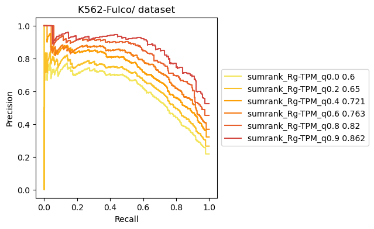

# 2. Accurate enhancer representation

The **Tichr** `siteToGene`module can be used to **characterizing enhancer-promoter interactions** based on `RgX` results. To predict E-P interactions, you must have a gold standard for benchmarking the `RgX` results. You can use the promoter-capture Hi-C, or other related methods to get the correct data.
Next, I will use a set of sample data to help you understand how to perform E-P prediction analysis using the **Tichr** `siteToGene` module.

### Prepare package and data

``` python
from tichr import tichr
from tichr import siteToGene

datadir = "../Data/SiteToGene"
rgxfile = f"{datadir}/K562_RgxDF.tsv"
rgfile = f"{datadir}/K562_RgDF.tsv"
outname = f"{datadir}/matched.tsv"

golddf = f"{datadir}/K562_gold_label.tsv"
goldcol = 10
truecol = 12
withhead = False
```

**Golddf is a data table containing the gold standard E-P pairs.** It need to be the following style (either with column title or not is allowed):

- 1st column: site chr
- 2nd column: site start
- 3rd column: site end
- `goldGeneCol`: Column number for the gene ID in golddf, this should be matched to the Rgx gene ID.
- `truecol`: Column number for True or False (or 0/1) to be a real site-to-gene links.
- `withhead`: If the gold df have column title or not.

Here is an example file:

| peakChr | peakStart | peakEnd   | peakID       | peakType      | geneChr | geneStart | geneEnd   | transcriptID      | geneID          | geneStrand | weight |
| ------- | --------- | --------- | ------------ | ------------- | ------- | --------- | --------- | ----------------- | --------------- | ---------- | ------ |
| chr7    | 100694352 | 100694774 | EH37E0917456 | Enhancer-like | chr7    | 100689448 | 100689448 | ENST00000275732.5 | ENSG00000146830 | -          | 1      |
| chr7    | 100694352 | 100694774 | EH37E0917456 | Enhancer-like | chr7    | 100351256 | 100351256 | ENST00000472646.1 | ENSG00000272752 | +          | 0      |
| chr7    | 100694352 | 100694774 | EH37E0917456 | Enhancer-like | chr7    | 100656461 | 100656461 | ENST00000160382.5 | ENSG00000077080 | -          | 0      |

### Prepare Rgx file

The Rgx file is the `RgxDf` obtained through `compute`.

A example Rgx format file is as followed:

| peakChr | peakStart | peakEnd  | epigenomeActivity   | geneSymbol        | geneChr | geneStart | geneEnd  | geneStrand | geneID             | weight | Rgx_rawvalue | Rgx_percent |
| ------- | --------- | -------- | ------------------- | ----------------- | ------- | --------- | -------- | ---------- | ------------------ | ------ | ------------ | ----------- |
| chr1    | 20290552  | 20291052 | 0.26389441413565384 | ENST00000568195.1 | chr1    | 25272548  | 25272548 | +          | ENSG00000187010.14 | 0.0    | 0.0          | 0.0         |
| chr1    | 20308450  | 20308950 | 0.24814898809465255 | ENST00000568195.1 | chr1    | 25272548  | 25272548 | +          | ENSG00000187010.14 | 0.0    | 0.0          | 0.0         |
| chr1    | 20328146  | 20328646 | 0.2605078694176051  | ENST00000568195.1 | chr1    | 25272548  | 25272548 | +          | ENSG00000187010.14 | 0.0    | 0.0          | 0.0         |

### Match the Rgx to the gold df 

You can use the `matchgold` function to match Rgx with the gold standard E-P pairs in golddf. Here is an exammple:

``` python
siteToGene.matched = matchgold(rgxfile,golddf,outname,goldGeneCol,
          percent=False,withhead=withhead,returnDF=True,
          predGeneCol=10,predScoreCol=12)
```

`percent`: default False means using the rgx raw value. If it is True, use Rgx ratio instead of Rgx value
`withhead`: if the golddf have column names
`returnDF`: let it be True.

If you want to display the results of the match, Tichr provides APIs to plot the match results as PRC and ROC:

**PRC**

This Precision-Recall curve demonstrates the performance of the **Tichr**  `siteToGene` module in predicting E-P pairs against a user-provided gold standard E-P dataframe.

``` python
showAUPRC(matched[truecol-1],matched.iloc[:,-1],"match1",outname="match1_auprc.pdf")
```


**ROC**

The ROC curve, like the PRC above, is used to demonstrate the predictive performance of the **Tichr** `siteToGene` module on the gold standard dataframe.

``` python
siteToGene.showROC(matched[truecol-1],matched.iloc[:,-1],"match1",outname="match1_roc.pdf")
```


If you want,  you can assign color, figure title and many things by your self.

Here is an example:

``` python
#PRC
plt.title("test title")
siteToGene.pltoneprc(matched[truecol-1],matched.iloc[:,-1],"match1","green")
plt.show()
#ROC
siteToGene.pltoneroc(matched[truecol-1],matched.iloc[:,-1],"match1","green")
plt.show()

```

### Plot multiple PRC

Tichr also supports plotting PRC (Precision-Recall Curve) for multiple Rgx simultaneously. Here is an example:

``` python
matched2 = siteToGene.matchgold(f"{datadir}/K562_RgxDF_type2.tsv",golddf,outname,goldcol,
          percent=False,withhead=withhead,returnDF=True)

matched3 = siteToGene.matchgold(f"{datadir}/K562_RgxDF_type3.tsv",golddf,outname,goldcol,
          percent=False,withhead=withhead,returnDF=True)
```

```
siteToGene.showAUPRC(matched[truecol-1],matched.iloc[:,-1],"match1",
         matched2[truecol-1],matched2.iloc[:,-1],"match2",
         matched3[truecol-1],matched3.iloc[:,-1],"match3",
         outname="3match_auprc.pdf")
```


``` python
siteToGene.showROC(matched[truecol-1],matched.iloc[:,-1],"match1",
         matched2[truecol-1],matched2.iloc[:,-1],"match2",
         matched3[truecol-1],matched3.iloc[:,-1],"match3",
         outname="3match_roc.pdf")
```


## Different Threshold

The **`diffrentThresh`** function can be used to view PRC under different thresholds, which helps in finding suitable parameters for Tichr.

#### Predict EP by different distance

You can set `threshType` as “distance” to Predict EP by different distance. Here is an example:

``` python
import os
outdir = "K562-Fulco/"
if not os.path.exists(outdir):
    os.makedirs(outdir)
tpmdir=f"{datadir}/K562.genes.TPM.txt"

siteToGene.diffrentThresh(rgxfile,rgfile,golddf,goldcol,outdir,tpmdir,
                threshType="distance",threshList=[10000,50000,100000,500000,1000000,5000000],
                tmpcolrep=[3,4,],rggeneID=5,tmpgeneID=2,rgxgeneID=10,
                onlyPlot=False)
```


#### Predict EP by different gene TPM

Similarly, you can also set `threshType`to "tpm" to predict EP based on different gene TPM values:

``` python
siteToGene.diffrentThresh(rgxfile,rgfile,golddf,goldcol,outdir,tpmdir,
                threshType="tpm",threshList=[0.0,0.2,0.4,0.6,0.8,0.9],
                tmpcolrep=[3,4,],rggeneID=5,tmpgeneID=2,rgxgeneID=10,onlyPlot=False)
```


#### Predict EP by different trends between Rgx and gene expression

The "sumrank" method based on Rg-TPM correlation ranking can also be used to predict EP, for example:

``` python
siteToGene.diffrentThresh(rgxfile,rgfile,golddf,goldcol,outdir,tpmdir,
                threshType="sumrank",threshList=[0.0,0.2,0.4,0.6,0.8,0.9],
                tmpcolrep=[3,4,],rggeneID=5,tmpgeneID=2,rgxgeneID=10,onlyPlot=False)
```



#### Choose threshold for Rgx

The `plotdensity`function can help you select an appropriate threshold for filtering Rgx:

``` python
siteToGene.plotdensity(rgxfile_raw,outdir,matchedwithhead = goldwithhead,matchcol=matchcol,truecol=truecol)
```


## How to filter E-P links

The highly enriched EP links are defined as the following steps:

1. Calculate RgX value based on multiomics data
2. Adjustment for RgX by raw value, gene TPM, and chromatin structure
3. Normalize RgX
4. Select maximum distance between gene and sites;
5. normRgX >1 and RgX ratio > 0.01 as enriched E-P links

#### Identify the regulatory sites of a gene set input

Selected genes from the E-P pair above, by directly search the same gene ID

#### Identify the target gens of regulatory sites

Selected targeted genes from the E-P pairs above, by `intersectBed` the E-P pairs above

## In silico deletions of given sites

To identify target genes affected by specific genomic loci (particularly those with limited RgX overlap), we performed in silico deletion analysis. This involved:

1. Removing input loci and recalculating Rg values
2. Conducting 100 random deletions to establish background Rg distributions
3. Calculating p-values by comparing deletion-induced Rg changes with random background
4. Defining significant targets (FDR-adjusted q-value < 0.05) after multiple testing correction

You can achieve it through function `silico`:

``` python
import pandas as pd
from tichr import insilico
```

Prepare input files:

``` python
RgDF_Ctrl = pd.read_csv(f"{datadir}/JQ1minus_BRD4_rep0_RP_RgDf.tsv",header=None,sep="\t")
RgxDF_Ctrl = pd.read_csv(f"{datadir}/JQ1minus_BRD4_rep0_RP_RgxDf.tsv",header=None,sep="\t")

deletepeakfile = f"{datadir}/BRD4.jq1lost.peak"
deletepeakDF=pd.read_csv(deletepeakfile,sep="\t",header=None)
```

- `RgDF_Ctrl`: Rg file 
- `RgxDF_Ctrl`: RgX file
- `deletepeakfile`: insilico deletion file

To validate the result, we can test the lost BRD4 peaks after JQ1 treatment and test if the affected genes are truly DEGs

``` python
insilico.silico(RgxDF_Ctrl,deletepeakDF,RgDF_Ctrl,degtype="down",degfdr=0.01,nrandom=20)
```

The results shows the goodnees of in silico deletions.

