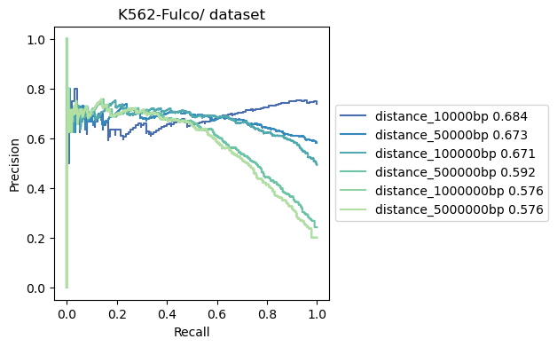
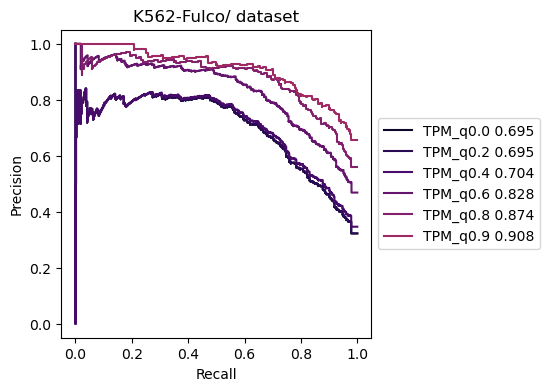

# 2. Study Site-to-Gene links

## Predict E-P
To predict E-P interactions, you must have a gold standard for benchmarking the rgx results. You can possiblly use the promoter-capture Hi-C, or other related methods to get the correct data

### Prepare gold df

``` python
import sys
sys.path.append('/home/wang/github/Tichr-CLI/tichr')
from tichr import *
rgxfile="auprcdata/K562_RgxDF.tsv"
outname = "auprcdata/matched.tsv"

golddf="auprcdata/K562_gold_label.tsv"
goldcol =10
truecol = 12
withhead=False
```

The golddf need to be the following style (either with column title or not is allowed):
- 1st column: site chr
- 2nd column: site start
- 3rd column: site end
- `goldGeneCol`: Column number for the gene ID in golddf, this should be matched to the Rgx gene ID.
- `truecol`: Column number for True or False (or 0/1) to be a real site-to-gene links.
- `withhead`: If the gold df have column title or not.

An example file is
| peakChr | peakStart | peakEnd | peakID        | peakType       | geneChr | geneStart | geneEnd | transcriptID       | geneID            | geneStrand | weight |
|---------|-----------|---------|----------------|----------------|---------|-----------|---------|---------------------|--------------------|-------------|--------|
| chr7    | 100694352 | 100694774 | EH37E0917456   | Enhancer-like  | chr7    | 100689448 | 100689448 | ENST00000275732.5   | ENSG00000146830  | -           | 1      |
| chr7    | 100694352 | 100694774 | EH37E0917456   | Enhancer-like  | chr7    | 100351256 | 100351256 | ENST00000472646.1   | ENSG00000272752  | +           | 0      |
| chr7    | 100694352 | 100694774 | EH37E0917456   | Enhancer-like  | chr7    | 100656461 | 100656461 | ENST00000160382.5   | ENSG00000077080  | -           | 0      |


### Prepare Rgx file
Use the standard Rgx format. Columns name should be kept.
File requirment for RgxDf
- column1: site chr 
- column2: site start 
- column3: site end
- column4: site epigenome signal
- column5: gene ID
- column6: gene chr
- column7: gene start
- column8: gene end
- column9: gene strand
- column10: gene symbol
- column11: site-to-gene weight
- column12: Rgx score
- column13: Rgx ratio

A example Rgx file obtained from Tichr:

| peakChr | peakStart | peakEnd | epigenomeActivity     | geneSymbol          | geneChr | geneStart | geneEnd | geneStrand | geneID             | weight | Rgx_rawvalue | Rgx_percent |
|---------|-----------|---------|------------------------|----------------------|---------|-----------|---------|-------------|---------------------|--------|---------------|--------------|
| chr1    | 20290552  | 20291052| 0.26389441413565384    | ENST00000568195.1    | chr1    | 25272548  | 25272548| +           | ENSG00000187010.14  | 0.0    | 0.0           | 0.0          |
| chr1    | 20308450  | 20308950| 0.24814898809465255    | ENST00000568195.1    | chr1    | 25272548  | 25272548| +           | ENSG00000187010.14  | 0.0    | 0.0           | 0.0          |
| chr1    | 20328146  | 20328646| 0.2605078694176051     | ENST00000568195.1    | chr1    | 25272548  | 25272548| +           | ENSG00000187010.14  | 0.0    | 0.0           | 0.0          |


### Match the Rgx to the gold df 

``` python
matched = matchgold(rgxfile,golddf,outname,goldGeneCol,
          percent=False,withhead=withhead,returnDF=True,
          predGeneCol=10,predScoreCol=12)
```
`percent`: default False means using the rgx raw value. If it is True, use Rgx ratio instead of Rgx value
`withhead`: if the golddf have column names
`returnDF`: let it be True.

PRC curve
``` python
showAUPRC(matched[truecol-1],matched.iloc[:,-1],"match1",)
```


ROC curve
``` python
showROC(matched[truecol-1],matched.iloc[:,-1],"match1",)
```


or you can assign color, figure title and many things by your self.
``` python
#PRC
plt.title("test title")
pltoneprc(matched[truecol-1],matched.iloc[:,-1],"match1","green")
plt.show()
#ROC
pltoneroc(matched[truecol-1],matched.iloc[:,-1],"match1","green")
plt.show()

```

### plot multiple PRC curves

When you have multiple Rgx file, for example, generated by various data, or by different tichr parameters, you can show them together

``` python
matched2 = matchgold("auprcdata/K562_RgxDF_type2.tsv",golddf,outname,goldGeneCol,
          percent=False,withhead=withhead,returnDF=True)

matched3 = matchgold("auprcdata/K562_RgxDF_type3.tsv",golddf,outname,goldGeneCol,
          percent=False,withhead=withhead,returnDF=True)
```

Plot them together

```
showAUPRC(matched[truecol-1],matched.iloc[:,-1],"match1",
         matched2[truecol-1],matched2.iloc[:,-1],"match2",
         matched3[truecol-1],matched3.iloc[:,-1],"match3",)
```


``` python
showROC(matched[truecol-1],matched.iloc[:,-1],"match1",
         matched2[truecol-1],matched2.iloc[:,-1],"match2",
         matched3[truecol-1],matched3.iloc[:,-1],"match3",)
```


#### predict EP by different distance
``` python
diffrentThresh(rgxfile_raw,rgfile_raw,golddf,goldcol,outdir,tpmfile,
                threshType="distance",threshList=[10000,50000,100000,500000,1000000,5000000],
                tmpcolrep=[3,4,],rggeneID=5,tmpgeneID=2,rgxgeneID=10,
                matchcol=matchcol,truecol=truecol,goldwithhead=goldwithhead,onlyPlot=False)
```



#### predict EP by different gene TPM
``` python
diffrentThresh(rgxfile_raw,rgfile_raw,golddf,goldcol,outdir,tpmfile,
                threshType="tpm",threshList=[0.0,0.2,0.4,0.6,0.8,0.9],
                tmpcolrep=[3,4,],rggeneID=5,tmpgeneID=2,rgxgeneID=10,
                matchcol=matchcol,truecol=truecol,goldwithhead=goldwithhead,onlyPlot=False)
```


#### predict EP by different trends between Rgx and gene expression
``` python
diffrentThresh(rgxfile_raw,rgfile_raw,golddf,goldcol,outdir,tpmfile,
                threshType="tpm",threshList=[0.0,0.2,0.4,0.6,0.8,0.9],
                tmpcolrep=[3,4,],rggeneID=5,tmpgeneID=2,rgxgeneID=10,
                matchcol=matchcol,truecol=truecol,goldwithhead=goldwithhead,onlyPlot=False)
```


#### Choose threshold for Rgx

``` python
plotdensity(rgxfile_raw,outdir,matchedwithhead = goldwithhead,matchcol=matchcol,truecol=truecol)
```


## study study

The highly enriched EP links are defined as the following steps:
1. calculate RgX value based on multiomics data
2. Adjustment for RgX by raw value, gene TPM, and chromatin structure
3. Normalized RgX
4. Select maximum distance between gene and sites; 
5. normRgX >1 and RgX ratio > 0.01 as enriched E-P links

## Identify the regulatory sites of a gene set input
selected genes from the E-P pair above, by directly search the same gene ID


## Identify the target gens of regulatory sites 
selected targeted genes from the E-P pairs above, by intersectBed the E-P pairs above

## in silico deletions of given sites

To identify the target genes affected by a given set of genomic loci (especially when they show limited overlap with RgX), we performed an in silico deletion analysis. Specifically, we removed the input loci and recalculated the Rg value for each gene. To assess the statistical significance of these changes, we conducted 100 random deletions of the same number of loci and obtained a background distribution of Rg values. For each gene, we calculated a p-value by comparing the in silico-deleted Rg value with the distribution from the random deletions. The resulting p-values were adjusted for multiple testing using the false discovery rate (FDR), and genes with an FDR-adjusted q-value less than 0.05 were considered significant targets of the input loci.

``` python
import sys
sys.path.append('/home/wang/github/Tichr-CLI/tichr')
from tichr import *
from insilico import *
```

prepare input files
``` python
Rgdir='/home/wang/Tichr/2024Oct-summary/ContextSpecific/RPE_siNIPBL_denovo/resultdf_all_hic/'
RgDF_Ctrl = pd.read_csv(Rgdir+"JQ1minus_BRD4_rep0_RP_RgDf.tsv",header=None,sep="\t")
RgxDF_Ctrl = pd.read_csv(Rgdir+"JQ1minus_BRD4_rep0_RP_RgxDf.tsv",header=None,sep="\t")

deletepeakfile = "/home/wang/Tichr/2025March/predictDEG-withadj/JQ1peak/BRD4.jq1lost.peak"
deletepeakDF=pd.read_csv(deletepeakfile,sep="\t",header=None)
```

- RgDF_Ctrl: Rg file 
- RgxDF_Ctrl: RgX file
- deletepeakfile: insilico deletion file

To validate the result, we can test the lost BRD4 peaks after JQ1 treatment and test if the affected genes are truly DEGs

``` python
silico(RgxDF_Ctrl,deletepeakDF,RgDF_Ctrl,degtype="down",degfdr=0.01,nrandom=20,)
```

the results shows the goodnees of in silico deletions.

