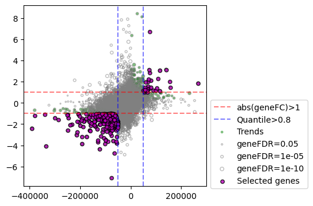
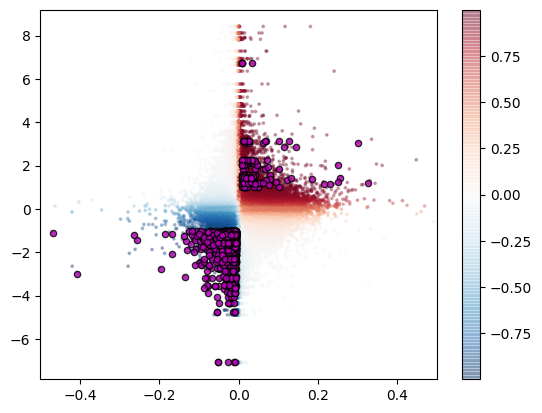
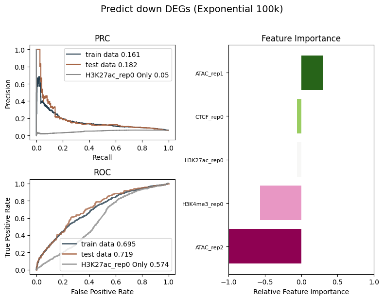

# 4. Attribute Transcriptional Changes

By capturing treatment-induced alterations in both epigenomic features and chromatin contacts, **Rg** and **RgX** enable the attribution of transcriptional changes to disrupted regulator binding or changes in chromatin interactions. Under this framework, genes with larger ΔRg values are expected to better predict DEGs (see the original paper).

The **Tichr** `studyDEG` module can be used to **predict relevant DEGs and attribute transcriptional changes**.


## Prepare input data

You can import the required packages and data into Python using the following code:

``` python

from tichr.studyDEG import *

datadir='./Data/DEG/'
RgDF_Ctrl = datadir+"Control_H3K27ac_RgDf.tsv"
RgxDF_Ctrl = datadir+"Control_H3K27ac_RgxDf.tsv"
RgDF_Treat = datadir+"siNIPBL_H3K27ac_RgDf.tsv"
RgxDF_Treat = datadir+"siNIPBL_H3K27ac_RgxDf.tsv"

```

The `RgDF` and `RgxDf` file are the standard `Rgx` and `Rg` results obtained through `compute`, see [here](1.Compute.md#what-is-rgdf-and-rgxdf)

##  Descriptions:

We can evaluate the regulatory drivers of transcriptional changes of one of the following:

- Rg-Full denotes the default Rg incorporating both epigenomic signals and contacts;

- Rg-Epi uses only epigenomic contributions (S2G weights set to 1); 

- Rg-3D uses only contact contributions (epigenomic signals set to 1); 

- Rg-Expon uses an exponential weighting function.


> For example, in our study, we found that cohesin knockdown primarily induced DEGs through altered chromatin contacts, with minimal contribution from H3K27ac. JQ1 treatment was mainly associated with BRD4 changes rather than 3D structural alterations. In contrast, shYy1 influenced transcription through H3K27ac and ATAC, while contact changes were not direct drivers. E2 stimulation was linked to P300 binding but showed little association with chromatin interactions, H3K27ac, or ER binding.


## Create object

``` python
diffobj = DiffEvent(RgDF_Ctrl,RgxDF_Ctrl,RgDF_Treat,RgxDF_Treat, 
                    inputtype="file",maxdistance=500000,seed=42, 
                    pdf=True,outdir="attribute")
```

- **RgDF_Ctrl**: File path (or pandas DataFrame object) for the control-group RgDf file.  
- **RgxDF_Ctrl**: File path (or pandas DataFrame object) for the control-group RgxDf file.  
- **RgDF_Treat**: File path (or pandas DataFrame object) for the treatment-group RgDf file.  
- **RgxDF_Treat**: File path (or pandas DataFrame object) for the treatment-group RgxDf file.  
- **maxdistance**: Maximum distance of site-to-gene links (default: 500,000 bp / 500 kb).  
- **outdir**: Output directory for saving figures.  
- **inputtype**: Input format, either `"file"` or `"pandas"`.  
- **seed**: Random seed used for generating the background distribution.  
- **pdf**: Boolean indicating whether to export figures in **PDF** (if `True`) or **PNG** format.


## Compute at fixed threshold

Tichr provides an API `selectgene` that enables rapid validation of whether differentially expressed genes (DEGs) are associated with epigenomic, 3D genomic features, or both (Rg values), along with graphical visualization capabilities:

``` python
diffobj.selectgene(selectGeneType="rg",label="select_rg",
                   threshhold=0.9,plot=True,plotbg=True)
```

The following are output:

- PRC curve of selected genes and random genes
  

- statistical comparison of selected genes and random genes
  


## Compute at multiple threshold

### Example usage

```
diffobj.quantilePRC(selectGeneType="rg",label="YouLabel",plotbg=True)
```

The following are output:

``` text
Plot the PRC curves under various quantile threshold
Computing at quantile 0.99
Computing at quantile 0.98
Computing at quantile 0.95
Computing at quantile 0.9
Computing at quantile 0.8
Computing at quantile 0.7
Computing at quantile 0.6
Computing at quantile 0.5
Computing at quantile 0.4
Computing at quantile 0.3
Computing at quantile 0.2
Computing at quantile 0.1
Computing at quantile 0
Finish...
Plot the background PRC curves under various quantile threshold
Computing background at quantile 0.99
Computing background at quantile 0.98
Computing background at quantile 0.95
Computing background at quantile 0.9
Computing background at quantile 0.8
Computing background at quantile 0.7
Computing background at quantile 0.6
Computing background at quantile 0.5
Computing background at quantile 0.4
Computing background at quantile 0.3
Computing background at quantile 0.2
Computing background at quantile 0.1
Computing background at quantile 0
Finish...
Plot the observed AUPRC versus background AUPRC under various quantile threshold
Adding wilcox p values...
Finish...
```

Genes were ranked by ΔRg and top-quantile subsets (q0–q0.99) were evaluated using PR curves and AUPRC to assess DEG prediction performance.Comparing Rg features (Default, Epi, 3D, and Expon) across different S2G distance cutoffs revealed whether transcriptional changes were attributable to specific epigenomic factors or chromatin contacts and at which distances. 


For statistical validation, background distributions were generated by randomly selecting the same number of genes.


The observed AUPRCs were compared against these null distributions.


### Full parameters

``` python
diffobj.quantilePRC(selectGeneType="rg",label="label",plotbg=True,plotpvalue='wilcox',
                    thlist=[ 0.8, 0.6, 0.4,  0.2,],plotylim=[0,0.7],plotallp=True)
```

- **selectGeneType**: One of `rg`, `3d`, or `epi`.  
  If your RgX/Rg files were generated using the **exponential** distance-decay model, you may also compare the results under the `rg` model, which reflects distance-decayed epigenomic regulation.

- **label**: A user-defined label used for visualization.

- **plotbg**: `True` or `False`.  
  Whether to plot the **background** PR curve (sometimes the background curve is very large and may dominate the plot).

- **plotpvalue**: Statistical test to use, either `'wilcox'` or `'ttest'`.

- **thlist**: A list of quantile cutoffs for selecting genes.  
  Example: `[0.8, 0.6, 0.4, 0.2]`.

- **plotylim**: The y-axis range for AUPRC values in the plot.

- **plotallp**: `True` or `False`.  
  If `True`, p-values for each quantile cutoff will also be plotted.


## Select relevant genes 

After identifying the major regulatory contributors, the most relevant genes were extracted by assessing concordance between
changes in expression and Rg , and corresponding regulatory sites were pinpointed by evaluating concordance between RgX and gene changes

``` python
diffobj.diffgene(selectGeneType="rg",selectDeg=True,
                selectQuantile=True,quantiTh=0.8,
                selectFc=True,fcTh=0.5,
                selectRank="sumrank0",selectRankTh=0.8,)
```

- **selectGeneType**: One of `rg`, `epi`, or `3d`.

- **selectDeg**: If `True`, select only differentially expressed genes (DEGs).

- **selectQuantile**, **quantiTh**: Select genes whose Rg changes fall within the top quantile (e.g., `quantiTh = 0.8` selects the top 20% most changed Rg).

- **selectFc**, **fcTh**: Select genes with absolute Rg log2 fold change greater than `fcTh`.

- **selectRank**, **selectRankTh**: Select genes based on the concordance of gene expression fold change and gene Rg change, using a rank-based threshold (`selectRankTh`).





**`diffobj.finalgene` provide the final selected genes**


## Select regulatory sites

After you run selectgene. The `diffEP`function can be used to select related functional sites. The main purpose is to output the related sites if they are related to the DEGs in the comparisons

``` python
diffobj.diffEP(selectdiffgene=True,selectRgxType="rgx",
               selectRgxQuantile=True,quantileRgxCut=0.8,
               selectRgxFold =True,RgxFcCut=0.5,
               selectRgxRank = "same",rgxRankCut=0.8)
```


- **`selectdiffgene`**  
  Use only the *selected DE genes* identified in previous steps.

- **`selectRgxType`**  
  Specify which regulatory score to use. Options:  
  - `rgx` — regulatory strength score  
  - `epix` — epigenome activity
  - `3dx` — 3D chromatin interaction score  

- **`selectRgxQuantile`, `quantileRgxCut`**  
  Select regions or genes with **top quantile changes** in RgX.  
  - `selectRgxQuantile = TRUE` enables quantile filtering  
  - `quantileRgxCut` defines the quantile threshold (e.g., 0.9)

- **`selectRgxFold`, `RgxFcCut`**  
  Select genes/regions with **absolute RgX fold change** above the cutoff.  
  - `selectRgxFold = TRUE`  
  - `RgxFcCut`: minimal fold change required (e.g., 1.5, 2)

- **`selectRgxRank`, `rgxRankCut`**  
  Select gene–RgX pairs showing **consistent or divergent trends** between  
  gene fold change and RgX fold change.  
  - `selectRgxRank = TRUE`  
  - `rgxRankCut`: correlation or rank cutoff to define “same/different trend”


These images will be displayed after executing the command. The selected Site-To-Gene links will be annotated in the figures：




**`diffobj.finalep` provide the final selected sites.


## Find the most related factors in a comparison

Because a single regulator may not fully account for all DEGs, **Rg values from multiple regulatory factors were integrated** to build a unified model that identifies the dominant contributors to transcriptional changes.

> To integrate multiple regulatory factors, **logistic regression** was performed using **ΔRg-derived features** to classify DEGs.  
> The **feature importance**, derived from the model coefficients, reflects the relative contribution of each regulatory factor to gene expression changes.

### Prepare data

``` python
from tichr.multiEpiPredict import *

datadir='./Data/DEG/'
Rgdir=f"{datadir}/resultdf_shYY1_hic/"

pair_list = [
    ["ATAC-seq_EPSC_shYy1_None_rep1_RP","ATAC-seq_EPSC_shCtrl_None_rep1_RP",],
    ["ATAC-seq_EPSC_shYy1_None_rep2_RP","ATAC-seq_EPSC_shCtrl_None_rep2_RP"],
    ["ChIP-Seq_EPSC_shYy1_CTCF_rep0_RP", "ChIP-Seq_EPSC_shCtrl_CTCF_rep0_RP", ],
    ["ChIP-Seq_EPSC_shYy1_H3K4me3_rep0_RP","ChIP-Seq_EPSC_shCtrl_H3K4me3_rep0_RP",],
    ["CUTTAG_EPSC_shYy1_H3K27ac_rep0_RP","CUTTAG_EPSC_shCtrl_H3K27ac_rep0_RP", ],
]

namelist = ["ATAC_rep1","ATAC_rep2","CTCF_rep0","H3K4me3_rep0","H3K27ac_rep0"]

```

The folder need to contain the standard RgDf file for all samples, with "RgDf.tsv" as ending. If  `maxdistance` is assigned, the corresponding RgX file need to be in the same folder as "RgxDf.tsv".


### Train models

``` python
obj = multiEpiPredict.manyTFpredict(Rgdir,pair_list,namelist,maxdistance=500000)

suptitle = "(HiC 500k)"
obj.makemodel()
obj.plotresult(showTF="H3K27ac_rep0",showName="H3K27ac_rep0 Only",suptitle=suptitle)

obj.makemodel("up")
obj.plotresult(showTF="H3K27ac_rep0",showName="H3K27ac_rep0 Only",suptitle=suptitle)

obj.makemodel("down")
obj.plotresult(showTF="H3K27ac_rep0",showName="H3K27ac_rep0 Only",suptitle=suptitle)

```

- `showTF`, `showName`: Select a single representative epigenomic signal and use **only that feature** to predict DEGs.  
  This option allows you to demonstrate the advantage of integrating **multiple epigenomic tracks** compared with relying on any single factor.

- `maxdistance`: Maximum distance for site-to-gene linkage.  
  When specified, the model will **recalculate Rg using the max-distance–filtered RgX matrix**, ensuring consistent evaluation across different regulatory factors.


This will output the following results.


