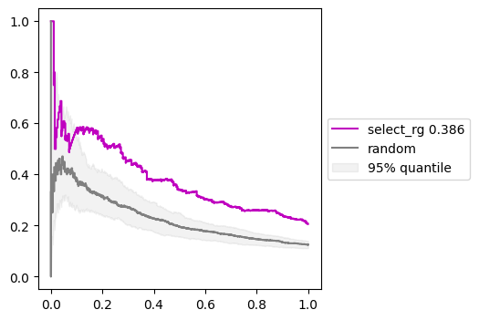
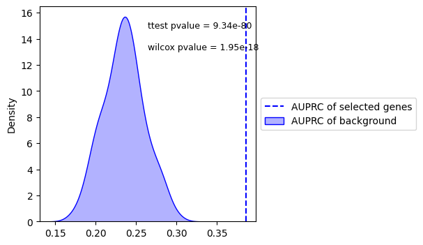

# 3.DEG analysis by TICHR

## Identify related genes and functional elements in a comparison

The purpose of this analysis if for identifying the involved genes and elements that are related to specific treatment. Therefor, two sets of multiomics data is required.

Next, we will demonstrate an example to show how to use this model for analysis. 

### Prepare package and data

``` python
import sys
sys.path.append('/home/sunpx/my_project/TichrTest/tichr')
from studyDEG import *
from multiEpiPredict import *

datadir='../Data/DEG/'
RgDF_Ctrl_file = datadir+"Control_H3K27ac_rep0_RP_RgDf.tsv"
RgxDF_Ctrl_file = datadir+"Control_H3K27ac_rep0_RP_RgxDf.tsv"
RgDF_Treat_file = datadir+"siNIPBL_H3K27ac_rep0_RP_RgDf.tsv"
RgxDF_Treat_file = datadir+"siNIPBL_H3K27ac_rep0_RP_RgxDf.tsv"
```

File requirement for RgDf

- column1: gene chrcolumn2: gene star
- column3: gene end
- column4: gene ID
- column5: gene symbol
- column6: gene strand
- column7: gene Fold change
- column8: gene FDR
- column9: gene TPM (average of treat and ctrl)
- column10: gene Rg score

The Rgx file is the `RgxDf` obtained through `compute`.

###  Predict DEGs based on Rg value 

You can validate if the DEGs is related to epi, or 3d, or both (rg) through `DiffEvent`:


``` python
diffobj = DiffEvent(RgDF_Ctrl_file,RgxDF_Ctrl_file,RgDF_Treat_file,RgxDF_Treat_file, outdir="")
diffobj.quantilePRC(selectGeneType="rg",label="select_rg",plotbg=True)
```

- `RgDF_Ctrl_file`: direction to control group RgDf file.
- `RgxDF_Ctrl_file`: direction to control group RgxDf file.

- `RgDF_Treat_file`: direction to treated group RgDf file.

- `RgxDF_Treat_file`: direction to treated group RgxDf file.

- `maxdistance`: max distance between promoter and site.

- `outdir`: direction for output figure.
- `inputtype`: could be "file" or "pandas".

- `seed`: used to select random gene.

- `pdf`: a Boolean variable used to specify whether to output images in PDF or PNG format.

- `selectGeneType`: rg, epi, 3d, fcrg, fcepi, fc3d

The following are output:

PRC of predict DEGs by Rg value, under different threshold of top quantile genes by the `selectGeneType` parameter.


PRC of predict DEGs by Rg value, using corresponding random genes.


AUPRC of selected genes prediction and random gene predictions.


### Compare selected genes and random genes

Tichr provides an API `selectgene` that enables rapid validation of whether differentially expressed genes (DEGs) are associated with epigenomic, 3D genomic features, or both (Rg values), along with graphical visualization capabilities:


``` python
diffobj.selectgene(selectGeneType="rg",label="select_rg",
                   threshhold=0.9,plot=True,plotbg=True)
```

The following are output:

- PRC curve of selected genes and random genes
  

- statistical comparison of selected genes and random genes
  

### Selecterelated genes by multiple critrias 

The main purpose is to output the related genes if they are related to the DEGs in the comparisons

``` python
diffobj.diffgene(selectGeneType="rg",quantiTh=0.8,selectQuantile=True,
                selectDeg=True,selectFc=False,fcTh=0.2,
                selectRank="same",sameTh=0.8,diffTh=0.8,)
```

- `selectGeneType` : (rg, epi, 3d, fcrg, fcepi, fc3d)
- `selectQuantile`, `quantiTh`: select top changed Rg
- `selectDeg`: focus degs
- `selectFc`,`fcTh`: select foldchange of Rg > fcTh
- `selectRank`, `sameTh`, `diffTh`: select same or different trends between gene FC and gene Rg


### Select the related functional sites by multiple critrias 

The main purpose is to output the related sites if they are related to the DEGs in the comparisons

``` python
diffobj.diffEP(selectdiffgene=True,selectRgxType="rgxpercent",
               selectRgxQuantile=True,quantileRgxCut=0.8,
               selectRgxFold =True,RgxFcCut=0.5,selectRgxRank = "same",rgxRankCut=0.8)
```

- `selectdiffgene`: use the selected gene mentioned above
- `selectRgxRatio`, `RgxRatioCut`: select major Rgx for each gene by Rgx ratio > RgxRatioCut (default 0.01)
- `selectRgxType`: rgx,epix,3dx,rgxpercent,fcepix,fc3dx,fcrgx
- `selectRgxQuantile`, `quantileRgxCut`: select top changed RgX
- `selectRgxFold`, `RgxFcCut`: elect foldchange of Rgx > RgxFcCut
- `selectRgxRank`, `rgxRankCut`: select same or different trends between gene FC and Rgx FC


## Study the most related factors in a comparison

If you have data on multiple epigenetic modifications, you can combine them to predict Differentially Expressed Genes (DEGs ).

Here is an example:

### Prepare data

``` python
Rgdir=f"{datadir}/resultdf_shYY1_hic/"

pair_list = [
    ["ATAC-seq_EPSC_shYy1_None_rep1_RP","ATAC-seq_EPSC_shCtrl_None_rep1_RP",],
    ["ATAC-seq_EPSC_shYy1_None_rep2_RP","ATAC-seq_EPSC_shCtrl_None_rep2_RP"],
    ["ChIP-Seq_EPSC_shYy1_CTCF_rep0_RP", "ChIP-Seq_EPSC_shCtrl_CTCF_rep0_RP", ],
    ["ChIP-Seq_EPSC_shYy1_H3K4me3_rep0_RP","ChIP-Seq_EPSC_shCtrl_H3K4me3_rep0_RP",],
    ["CUTTAG_EPSC_shYy1_H3K27ac_rep0_RP","CUTTAG_EPSC_shCtrl_H3K27ac_rep0_RP", ],
]
namelist = ["ATAC_rep1","ATAC_rep2","CTCF_rep0","H3K4me3_rep0","H3K27ac_rep0"]
```

The folder need to contain the standard RgDf file for all samples, with "RgDf.tsv" as ending. If  `maxdistance` is assigned, the corresponding RgX file need to be in the same folder as "RgxDf.tsv".


### Predict DEGs with multiple types of epigenomes


``` python
obj = manyTFpredict(Rgdir,pair_list,namelist,maxdistance=500000)

suptitle = "(HiC 500k)"
obj.makemodel()
obj.plotresult(showTF="H3K27ac_rep0",showName="H3K27ac_rep0 Only",suptitle=suptitle)

obj.makemodel("up")
obj.plotresult(showTF="H3K27ac_rep0",showName="H3K27ac_rep0 Only",suptitle=suptitle)

obj.makemodel("down")
obj.plotresult(showTF="H3K27ac_rep0",showName="H3K27ac_rep0 Only",suptitle=suptitle)

```

- `showTF`, `showName`: select one typical epigenomic signal, use only that to predict DEGs. This will prove the goodness of using multiple epigenomic tracks.
- `maxdistance`: use the max distance Rgx to re-caluculate Rg

This will output the following results.


