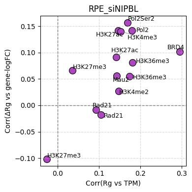
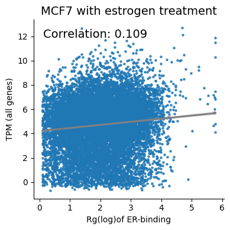
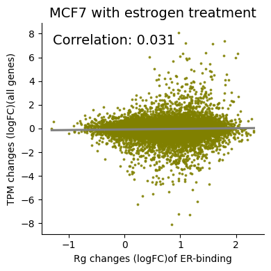
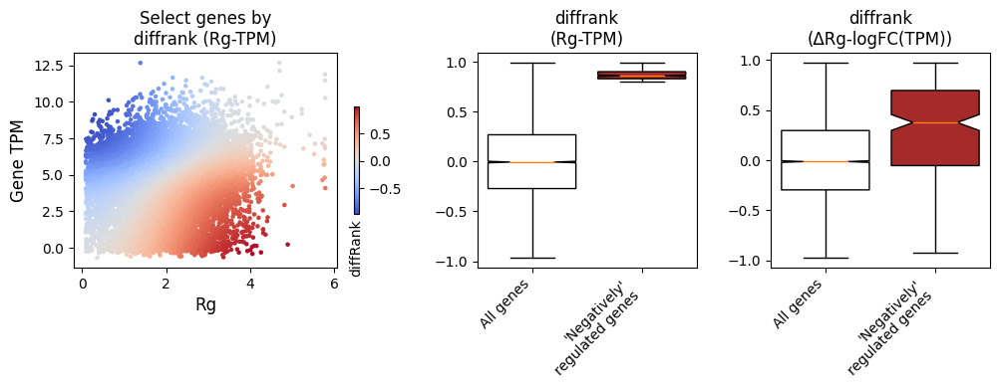
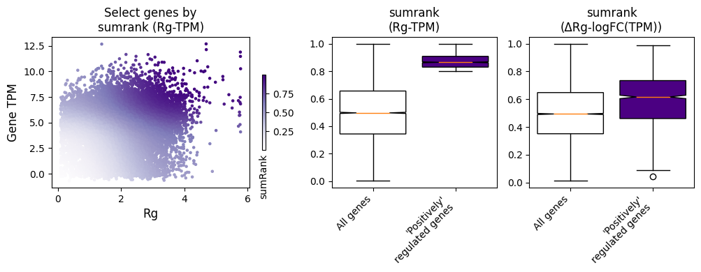
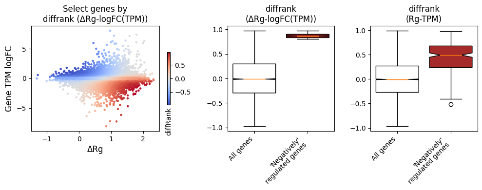
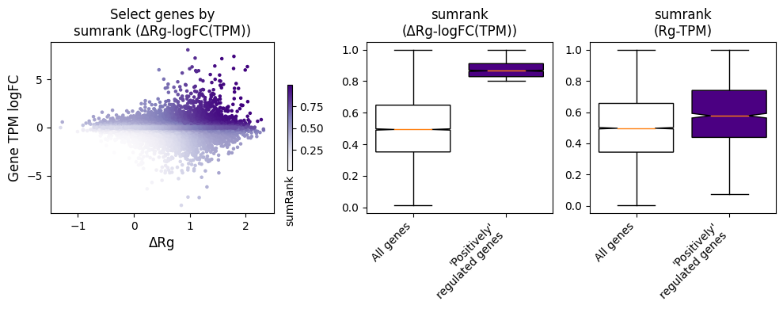

# 4.Treatment-associated regulation

## Correlation Analysis Between Gene Rg and Gene Expression

### Input data

The input consists of paired files in the format `*_RgDf.tsv`, where each pair corresponds to a **treatment** and **control** condition.

Each file should contain at least the following columns:

- **Column 7**: Gene expression log fold-change  
- **Column 8**: TPM values  
- **Column 9**: Gene Rg values  

The other columns are as same as `compute` RgDf.

**Format example (`*_RP_RgDf.tsv`):**

```
chr21	6111130	6123778	ENSG00000275993	ENSG00000275993	+	-1.73864248825759	7.784942363362921e-09	7.07768626695491	0.0
chr21	17513129	17593579	ENSG00000154639	CXADR	+	2.04164367091244	9.25684832742846e-09	5.14892581358436	4579.490782097491
```

---

### Prepare package and data

We provide a set of example data to help you get started quickly.

Specify the list of treatment–control pairs you want to compare:

```python
import sys
sys.path.append('/home/sunpx/my_project/TichrTest/tichr')
from tichr import *
from treatment import *

datadir = "../Data/Treatment/"

pair_list = [
    ['siNIPBL_AFF4_rep0','Control_AFF4_rep0'],
    ['siNIPBL_H3K27ac_rep0','Control_H3K27ac_rep0'],
    ['siNIPBL_H3K27ac_rep2','Control_H3K27ac_rep2'],
    ['siNIPBL_H3K27me3_rep0','Control_H3K27me3_rep0'],
    ['siNIPBL_H3K27me3_rep2','Control_H3K27me3_rep2'],
    ['siNIPBL_H3K36me3_rep0','Control_H3K36me3_rep0'],
    ['siNIPBL_H3K36me3_rep2','Control_H3K36me3_rep2'],
    ['siNIPBL_H3K4me2_rep0','Control_H3K4me2_rep0'],
    ['siNIPBL_H3K4me3_rep0','Control_H3K4me3_rep0'],
    ['siNIPBL_Mau2_rep0','Control_Mau2_rep1'],
    ['siNIPBL_Pol2_rep0','Control_Pol2_rep0'],
    ['siNIPBL_Pol2Ser2_rep0','Control_Pol2Ser2_rep0'],
    ['siNIPBL_Rad21_rep0','Control_Rad21_rep1'],
    ['siNIPBL_Rad21_rep2','Control_Rad21_rep2'],
    ['JQ1plus_BRD4_rep0','JQ1minus_BRD4_rep0'],
]
```

Also, define a corresponding list of labels for plotting:

```python
factorlist = [
    "AFF4","H3K27ac","H3K27ac","H3K27me3","H3K27me3","H3K36me3","H3K36me3",
    "H3K4me2","H3K4me3","Mau2","Pol2","Pol2Ser2","Rad21","Rad21","BRD4"
]
```

---

### Run correlation analysis

Use the built-in `corrfunc` function to compute the correlation values for all defined pairs:

```python
corrrg, corrdelta = corrfunc(datadir,pair_list, corrtype="pearson",suffix="_RgDf.tsv")
```

- **corrrg**: correlation between mean Rg and mean TPM  
- **corrdelta**: correlation between ΔRg and gene logFC  

You may also set `corrtype="spearman"` to compute Spearman correlation.

---

### **Result Visualization**

The function `plot_correlation_scatter` creates a scatter plot of the results:

```python
plot_correlation_scatter(corrrg, corrdelta, factorlist, title="RPE_siNIPBL")
```



- **X-axis**: correlation between Rg and TPM  
- **Y-axis**: correlation between ΔRg and gene logFC  
- **Labels**: experimental marks (e.g., H3K27ac, H3K4me3, BRD4)  

Each point represents one experiment–control pair.

**Upper part of the plot**: marks where ΔRg and ΔTPM are strongly positively correlated, and their changes (ΔRg) are consistent with gene expression changes (**treatment-associated regulation**).  

**Right part of the plot**: marks where Rg and TPM are strongly positively correlated (**general regulation**).  


## Check the consistency between Rg-TPM and ΔRg-logFC(TPM)

### Prepare Rg and RgX file of two conditions

``` python
import sys
sys.path.append('/home/wang/github/Tichr-CLI/tichr')
from tichr import *
from context import *

rgCtrl_path = "../Data/Negative/Ctrl_RgDf.tsv"
rgTreat_path = "../Data/Negative/Treat_RgDf.tsv"
rgxCtrl_path = "../Data/Negative/Ctrl_RgxDf.tsv"
rgxTreat_path = "../Data/Negative/Treat_RgxDf.tsv"
```

File requirement for RgDf. You can prepare column1~9 as the input file of tichr `candidateGeneFile`.

- column1: gene chr
- column2: gene star
- column3: gene end
- column4: gene ID
- column5: gene symbol
- column6: gene strand
- column7: gene Fold change
- column8: gene FDR
- column9: gene TPM (average of treat and ctrl)
- column10: gene Rg score

The Rgx file is the `RgxDf` obtained through `compute`.

#### Combine treat and ctrl

``` python
rg_merged,rgx_merged = mergeDF(rgCtrl_path,rgTreat_path,rgxCtrl_path,rgxTreat_path,minRgx=0.1,minRgxRatio=0.01)
```

`minRgx`: filter the site-to-gene links by RgX value > minRgx
`minRgxRatio`: filter the site-to-gene links by RgX Ratio > minRgxRatio

The returned `rgx_merged` is a pandas DataFrame object containing the following columns:

- column12: RgX score for Ctrl
- column13: RgX ratio, averaged by Ctrl and Treat
- column14: RgX score for Treat

The returned `rg_merged` is a pandas DataFrame object containing the following columns:

- column10: Rg score for Ctrl
- column11: Rg score for Treat


## Compare

``` python
prepare_select_by_rank(rg_merged, basedon="rg",filetype="pandas",                        
                       title="MCF7 with estrogen treatment",label="of ER-binding",genelabel="(all genes)",outprefix="MCF7")
```

- `basedon`: could be "rg" or "deltarg". For example, if rg is selected, the program will selected genes with highly related Rg-TPM, and examine if the changes of them， i.e., ΔRg-logFC(TPM) ， are also related.

- `filetype`: could be "pandas" or "file", for the format of input `rg_merged`. If file, a tab-separated without head is needed.

- `diffrank_cutoff` ,  `sumrank_cutoff`: cutoff to selected highly correlated genes by diffrank or sumrank.

  Other parameters are used for visualizations.

There are mainly three parts of output

1. Scatter plot between Rg and TPM, between ΔRg and logFC(TPM).





2. Select top correlated genes by Rg-TPM diffrank (left and middle), examine the diffrank of ΔRg-logFC(TPM)



3. Select top correlated genes by Rg-TPM sumrank (left and middle), examine the sumrank of ΔRg-logFC(TPM)



You can also select by ΔRg-logFC(TPM)



