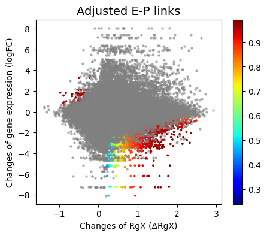
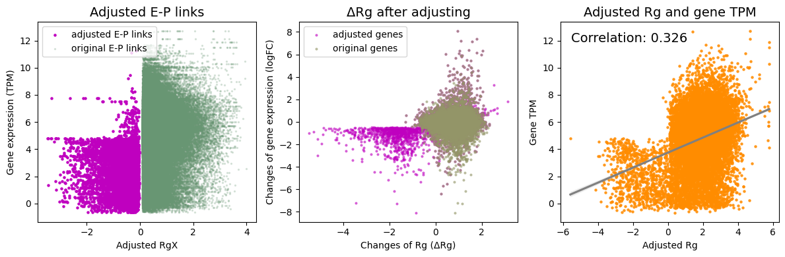
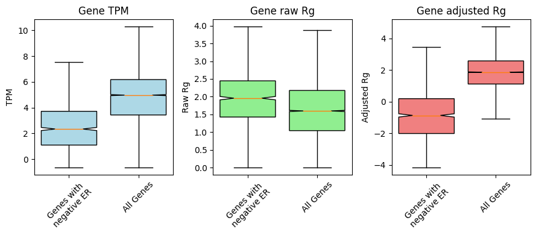

# 5. Identify context-specific negative regulation

**Tichr** can be used to **identifying negative regulation for context-specific regulators**. We provide  `context` module to conveniently implement related analyses. Through this module, you can conveniently implement a pre-prepaired **bootstrap iterative algorithm** to identify **context-specific** (negative) **regulation** and optimize the regulatory potential of genes(**Rg**).

Here, we have prepared a sample dataset to help you quickly learn how to use them:

## Prepare package and data

``` python
from tichr import context

datadir="../Data/Negative"

rgCtrl_path = f"{datadir}/Ctrl_RgDf.tsv"
rgTreat_path = f"{datadir}/Treat_RgDf.tsv"
rgxCtrl_path = f"{datadir}/Ctrl_RgxDf.tsv"
rgxTreat_path = f"{datadir}/Treat_RgxDf.tsv"
```

File requirement for RgDf. You can prepare column1~9 as the input file of **tichr** `candidateGeneFile`.

- column1: gene chr
- column2: gene star
- column3: gene end
- column4: gene ID
- column5: gene symbol
- column6: gene strand
- column7: gene Fold change
- column8: gene FDR
- column9: gene TPM (average of treat and ctrl)
- column10: gene Rg score

The Rgx file is the `RgxDf` obtained through `compute`.

Combine treated and control group data:

``` python
rg_merged,rgx_merged = contextmergeDF(rgCtrl_path,rgTreat_path,rgxCtrl_path,rgxTreat_path,minRgx=0.1,minRgxRatio=0.01)
```

`minRgx`: filter the site-to-gene links by `RgX value > min Rgx`
`minRgxRatio`: filter the site-to-gene links by `RgX Ratio > min RgxRatio`

The returned `rgx_merged` is a pandas DataFrame object containing the following columns:

- column12: RgX score for Ctrl
- column13: RgX ratio, averaged by Ctrl and Treat
- column14: RgX score for Treat

The returned `rg_merged` is a pandas DataFrame object containing the following columns:

- column10: Rg score for Ctrl
- column11: Rg score for Treat


## Identify negatively functional site-to-gene pairs

Tichr can identify negatively functional site-to-gene pairs through the following steps:

1. **Data Integration & Baseline:** Differential chromatin accessibility data (from TiChR) and differential gene expression (DEG) data from two conditions are integrated. A baseline Pearson correlation between gene-level regulatory signal (Rg) and gene expression (TPM) is computed.
2. **Candidate Selection:** Site-to-gene links are selected based on two criteria:
   - The regulatory site itself shows significant change (|logFC| > 0.5, FDR < 0.1).
   - The linked gene is differentially expressed (|logFC| > 1, FDR < 0.05).
3. **Identification of Negative Candidates:** From the selected links, those where the direction of change in regulation (ΔRgX) is opposite to the direction of change in gene expression (gene logFC) are identified as candidate negative links (i.e., ΔRgX * gene logFC < 0).
4. **Signal Recalculation & Validation:** For these candidate negative links:
   - A modified regulatory signal (**RgX**) is calculated by inverting ΔRgX and weighting it by its rank difference with the gene's logFC.
   - A new gene-level regulatory score (**Rg**) is generated by aggregating the recalculated RgX' values.
5. **Iterative Improvement:**
   - The correlation between the new score (**Rg**) and TPM is compared to the original baseline.
   - If correlation improves, the consistency of the rank difference (diffrank) for each individual gene is checked.
   - If all genes show improved rank coherence, the process stops.
   - If not, only the genes with improved diffrank are kept, the set of negative links is refined based on this subset, and the process (steps 4-5) repeats.
6. **Termination:** The iterative loop continues until no further improvement in the correlation is observed.

Here is an example, the rg_merged and rgx_merged are used:

``` python
outdir="NegativeResults"
if not os.path.exists(outdir): os.makedirs(outdir)
context.extractNeg(rg_merged, rgx_merged,showInteration=False,
           corrtype="pearson",filetype="pandas",
           outdir=outdir,outname="ERnegative",minRgxRatio=0.01)
```

- `filetype`:  could be "pandas" or "file", for the format of input `rg_merged` and `rgx_merged`. If it's "file", a tab-separated without head is needed.
- `showInteration`: if show the results of each Interation. Default=False
- `corrtype`: could be "spearman" or "pearson". Default="pearson"
- `outdir`: output directory 
- `outname`: output file prefix
- `minRgxRatio`: minimal Rgx ratio for negative s2g links.

There are serverl outout:

1. Text information

``` 
pearson correlation - Before: 0.1094, After: 0.3264, Difference: 0.2170
ERnegative
Number of genes with negative sites: 1108
Percentage of genes  with negative sites: 0.2875681287308591
Number of negative sites: 7012
Percentage of negative sites for degs: 0.22255371822134765
```

2. Tab-separated output files for negtive s2g links. Those files are subset of rgx_merged
   - ERnegative_negSite.tsv
   - ERnegative_negSite_filterRgxRatio.tsv

3. Visualizations

​	3.1 Final selected site-to-gene links. In the plot, the s2g links highlighted in color are those identified as context-specific:



​	3.2 Adjusted links and genes:



​	3.3 The adjustment for negative links can significanly improve the relationships between Rg-TPM and ΔRg-logFC(TPM)



## Replicated epigenome data

If you have replicated epigenomics experimental data, you can refer to the following code to complete the analysis for this section:

``` python
folder="/home/sunpx/my_project/TichrTest/Data/Negative/resultdf_shYY1_hic/"
shCtrl_rep1_Rg = folder+"ATAC-seq_EPSC_shCtrl_None_rep1_RP_RgDf.tsv"
shCtrl_rep1_Rgx = folder+"ATAC-seq_EPSC_shCtrl_None_rep1_RP_RgxDf.tsv"
shCtrl_rep2_Rg = folder+"ATAC-seq_EPSC_shCtrl_None_rep2_RP_RgDf.tsv"
shCtrl_rep2_Rgx = folder+"ATAC-seq_EPSC_shCtrl_None_rep2_RP_RgxDf.tsv"
shYy1_rep1_Rg = folder+"ATAC-seq_EPSC_shYy1_None_rep1_RP_RgDf.tsv"
shYy1_rep1_Rgx= folder+"ATAC-seq_EPSC_shYy1_None_rep1_RP_RgxDf.tsv"
shYy1_rep2_Rg = folder+"ATAC-seq_EPSC_shYy1_None_rep2_RP_RgDf.tsv"
shYy1_rep2_Rgx = folder+"ATAC-seq_EPSC_shYy1_None_rep2_RP_RgxDf.tsv"

rgCtrl_file = [shCtrl_rep1_Rg,shCtrl_rep2_Rg,]
rgTreat_file = [shYy1_rep1_Rg,shYy1_rep2_Rg,]
rgxCtrl_file = [shCtrl_rep1_Rgx,shCtrl_rep2_Rgx]
rgxTreat_file = [shYy1_rep1_Rgx,shYy1_rep2_Rgx]

rg_merged,rgx_merged = context.mergeDFmany(rgCtrl_file,rgTreat_file,rgxCtrl_file,rgxTreat_file,minRgx=0.1,minRgxRatio=0.01)

context.extractNeg(rg_merged, rgx_merged,showInteration=False,
           corrtype="pearson",filetype="pandas",
           outdir="negative",outname="ERnegative",minRgxRatio=0.01,
           epifdr=True)
```

The output results of this part are similar to those obtained using single experimental dataset.