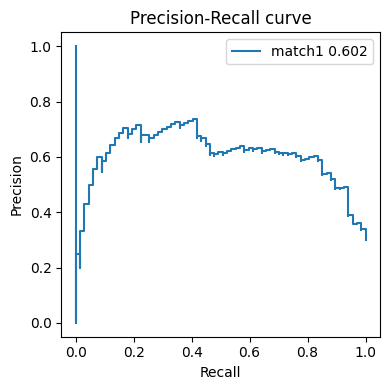
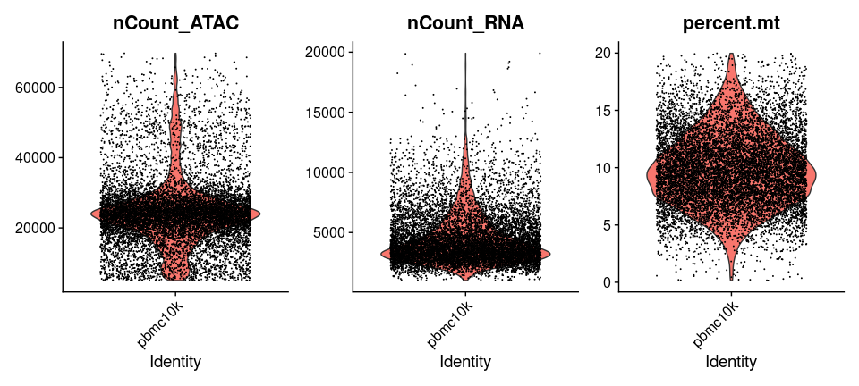
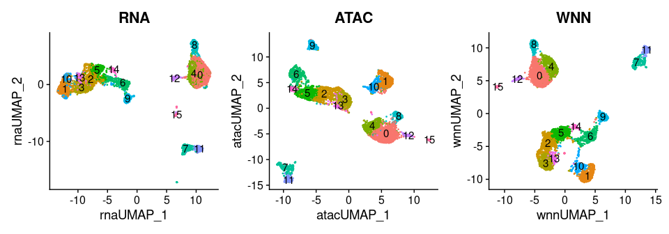
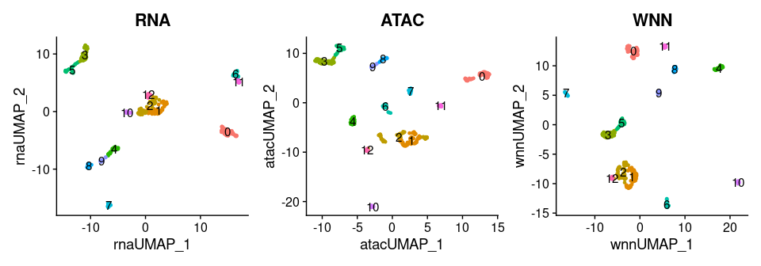

# 7. Cross-sample analysis of large-scale and single-cell data

Building on small-sample analyses, **TICHR** was extended to large-scale multi-omics datasets to capture **cross-sample transcriptional heterogeneity**.  
The **Tichr** `largescale` module enables **cross-sample analysis of large-scale and single-cell data** in a unified framework.

**If you want to quickly get started with a sample dataset, click [here](#quick-start).**

## Overview

The `largescale` class is designed as follows:

### 1.Import data

```python
class largescale:
    def __init__(self, epiFile, genefile, hicFile, gt, hicRes=25000):
        ...
```

- **`epiFile`**: Epigenomic signal file in a BED-like format.  
  The signal values should be provided in **column 4**, and each row represents one genomic site.

- **`genefile`**: Gene expression file containing the columns `chr`, `tss`, and `geneSymbol` (or gene ID), followed by expression values for each sample.  
  Each row represents one gene.

- **`hicFile`**: Hi-C contact file in Juicer `.hic` format.

- **`gt`**: Genome table file, as described [here](1.Compute.html#required-parameters).

- **`hicRes`**: Hi-C resolution (default = 25,000).


During object initialization:

- Epigenomic signals are loaded into `self.epiDf`.
- Gene expression data are loaded into `self.exprDf`.
- Hi-C data are processed using `gethicfile` and stored in `self.nomhicdf`.


### 2. Process and Calculate

The main calculation functions are defined as follows:

```python
def process(self, method="Expon", maxdistance=200000, threads=8,
            halfDistance=10000, outname="outname"):
    ...
```

#### Supported Methods

`method = "Expon"` is the default setting. Alternatively, you can specify **`method`** as one of the strategies listed below.

- **Correlation-based**
  - Computes the correlation between epigenomic signals and gene expression.
  - Options: `Pearson` or `Spearman`.

- **Distance / Hi-C weighted**
  - Assigns weights using exponential distance decay: `Expon`.
  - Weights epigenomic signals by Hi-C interaction strength: `HiC`.

- **Linear machine learning models**
  - `OLS`: Ordinary least squares regression  
    *(gene expression ~ epigenomic signals)*.
  - `Expon+OLS`: Epigenomic signals weighted by exponential distance, followed by linear regression.
  - `HiC+OLS`: Epigenomic signals weighted by Hi-C contacts, followed by linear regression.

- **Tree-based models**
  - `XGB`: XGBoost regression model.
  - `Expon+XGB`: Distance-weighted epigenomic signals combined with XGBoost.
  - `HiC+XGB`: Hi-C–weighted epigenomic signals combined with XGBoost.


#### Other parameters

- **`maxdistance`**: Maximum genomic distance allowed between sites and genes.
- **`halfDistance`**: Half-decay parameter used in the `Expon` distance-weighting method.
- **`threads`**: Number of CPU threads used for computation.
- **`outname`**: Prefix for output files.


### 3. Expected output

All strategies generate two types of outputs:
- **Importance scores** for each site-to-gene (S2G) link.
- **Representative regulatory effects** for each gene.

For more detailed explanations, please refer to our original paper.


---

## Quick Start

### Example data

- Epigenomic signal file: `dhs.chr21.bed`

Each row represents a genomic site, and columns after genomic coordinates represent epigenomic signal values across different samples.

| chr   | start   | end     | A549   | AG04449 | AG04450 | AG09309 | AG09319 | AG10803 | AoAF  |
|-------|---------|---------|--------|---------|---------|---------|---------|---------|-------|
| chr21 | 9414400 | 9414550 | 0.0068 | 0.0057  | 0.0057  | 0.0080  | 0.0362  | 0.0089  | 0.0274 |
| chr21 | 9415625 | 9415775 | 0.0265 | 0.0044  | 0.0044  | 0.0292  | 0.0084  | 0.0078  | 0.0273 |
| chr21 | 9416600 | 9416750 | 0.0536 | 0.0456  | 0.0069  | 0.0092  | 0.0108  | 0.0101  | 0.0086 |
| chr21 | 9417005 | 9417155 | 0.0294 | 0.0476  | 0.0062  | 0.0857  | 0.1005  | 0.0097  | 0.0080 |
| chr21 | 9417425 | 9417575 | 0.0060 | 0.0503  | 0.0047  | 0.0333  | 0.0419  | 0.0377  | 0.0066 |


- Gene expression file: `exp.chr21.bed`

Each row represents a gene, and columns after gene identifiers represent expression values across different samples.

| chr   | tss        | geneSymbol | A549  | AG04449 | AG04450 | AG09309 | AG09319 | AG10803 | AoAF |
|-------|------------|------------|-------|---------|---------|---------|---------|---------|------|
| chr21 | 10906336.0 | TPTE       | 3.149 | 3.893   | 3.167   | 3.477   | 3.311   | 3.434   | 4.088 |
| chr21 | 15579234.0 | LIPI       | 0.014 | 0.352   | 0.297   | 0.242   | 0.163   | 0.300   | 0.000 |
| chr21 | 15588531.0 | RBM11      | 0.251 | 0.236   | 0.764   | 0.000   | 1.159   | 1.141   | 0.000 |
| chr21 | 15755785.0 | HSPA13     | 8.274 | 9.158   | 8.833   | 8.610   | 9.408   | 9.157   | 8.028 |
| chr21 | 15872973.0 | SAMSN1     | 0.388 | 0.242   | 0.266   | 0.000   | 0.332   | 0.526   | 0.566 |


### Demo analysis

Here, we have prepared a sample dataset along with some example code to demonstrate how to quickly use Tichr for large-scale data analysis.

```python
from tichr.large import *

epiFile="./Data/Large/dhs.chr21.bed"
genefile="./Data/Large/exp.chr21.bed"
hicFile="../ENCFF621AIY.hic"
# You can download the "hicFile" throuth the following url: 
# https://www.encodeproject.org/files/ENCFF621AIY/@@download/ENCFF621AIY.hic
gt="./Data/Large/genome_table"
# Create object
obj = largescale(epiFile, genefile, hicFile, gt, hicRes=50000)
# Perform analysis
outdir="LargeResults"
obj.process(method="HiC", maxdistance=200000, outname=outdir)
```
### Output

After running the above code, two output files will be generated.


1. Site–Gene importance for each S2G  
**File:** `LargeResults_HiC_importance.tsv`

This file reports the **importance score** for each site–gene (S2G) pair.  
Each row corresponds to **one regulatory site linked to one gene**.

- Column description

| Column name | Description |
|------------|------------|
| `dhs_chr` | Chromosome of the regulatory site |
| `dhs_start` | Start position of the regulatory site |
| `dhs_end` | End position of the regulatory site |
| `gene_chr` | Chromosome of the target gene |
| `gene_tss` | Transcription start site (TSS) of the gene |
| `gene_symbol` | Gene symbol |
| `importance` | Importance score of the site–gene link |

- Example

| dhs_chr | dhs_start | dhs_end | gene_chr | gene_tss | gene_symbol | importance |
|--------|-----------|---------|----------|----------|-------------|------------|
| chr21 | 10742020 | 10742170 | chr21 | 10906336 | TPTE | 0.0 |
| chr21 | 10742240 | 10742390 | chr21 | 10906336 | TPTE | 0.0 |
| chr21 | 10775845 | 10775995 | chr21 | 10906336 | TPTE | 0.0 |
| chr21 | 10776145 | 10776295 | chr21 | 10906336 | TPTE | 0.0 |
| chr21 | 10776825 | 10776975 | chr21 | 10906336 | TPTE | 0.0 |


2. Regulatory effect for each gene  
**File:** `LargeResults_HiC_predicted.tsv`

This file reports **representative regulatory effects** for each gene across different cell types or samples.

- Column description

| Column name | Description |
|------------|------------|
| `chr` | Gene chromosome |
| `tss` | Gene transcription start site |
| `geneSymbol` | Gene symbol |
| Sample columns | Predicted regulatory effects for each cell type |

- Example

| chr | tss | geneSymbol | A549 | AG04449 | AG04450 | AG09309 | AG09319 | AG10803 | AoAF |
|-----|-----|------------|------|---------|---------|---------|---------|---------|------|
| chr21 | 10906336 | TPTE | 0.0 | 0.0 | 0.0 | 0.0 | 0.0 | 0.0 | 0.0 |
| chr21 | 15579234 | LIPI | 8172.57 | 8508.66 | 8243.19 | 8488.66 | 7567.41 | 7550.23 | 7048.38 |
| chr21 | 15588531 | RBM11 | 7969.84 | 8235.38 | 8010.33 | 8264.79 | 7345.98 | 7295.66 | 6851.91 |
| chr21 | 15755785 | HSPA13 | 23165.53 | 22066.85 | 21642.67 | 22210.93 | 24753.84 | 23490.83 | 24992.37 |


### Interpretation

| File | Interpretation |
|------|---------------|
| `LargeResults_HiC_importance.tsv` | Identifies which regulatory sites contribute most strongly to each gene |
| `LargeResults_HiC_predicted.tsv` | Summarizes representative regulatory effects acting on each gene across samples |


---

## Downstream analysis

This tutorial demonstrates how to visualize the **predicted gene expression matrix** from `largescale` using dimensionality reduction methods and compare clustering results with known tissue annotations.

Here is an example:

### Load Data

```python
import pandas as pd

datadir="./Data/Large"
# Predicted expression matrix
df = pd.read_csv(f"{datadir}/testclass_RP_predicted.tsv", sep="\t")

# Cell type annotations
cellDF = pd.read_csv(f"{datadir}/celltype.tsv", sep="\t")
cellDF = cellDF.set_index('CANONICAL')
```

Maps canonical cell identifiers to tissue types.  
Example:

```
CANONICAL     CELLTYPE          TISSUE
A549          A549              Epithelial
AG04449       SkinFibroblast    Fibroblast
AG04450       LungFibroblast    Fibroblast
AG09309       SkinFibroblast    Fibroblast
...
Th1           Th1               Hematopoietic
Th2           Th2               Hematopoietic
```


### Dimensionality Reduction Function

#### Demo analysis
We define a function `dimensionality_reduction_plot` to reduce cell-type profiles into 2D space and plot them:

```python
ari_score = dimensionality_reduction_plot(df,cellDF, method="UMAP",
                                          label="Predicted Expression",
                                          legend=True,outname="outname")
```

This command performs the following steps:

1. Apply **UMAP** to cell-type profiles.
2. Cluster the samples using **PCA followed by K-Means** clustering (`k = 15`).
3. Compare the inferred clusters with known tissue annotations using the **ARI score**.
4. Generate a 2D scatter plot colored by tissue type.


#### Full parameters

- **`method`**: Dimensionality reduction method.  
  Options: `UMAP`, `TSNE`, or `PCA`.

- **`legend`**:  
  Boolean indicating whether to display the figure legend.

- **`label`**:  
  Label used for annotating the plot.

- **`outname`**:  
  Output file name (PDF format).

- **`k`**:  
  Number of clusters for k-means clustering.  
  This value should match the number of true cell types.


#### Interpretation

- **Scatter Plot**: Each dot represents one **cell type**, positioned by similarity of its predicted expression profile.  
- **Colors**: Correspond to tissue categories (Fibroblast, Epithelial, Hematopoietic, etc.).  
- **ARI Score**: Quantifies agreement between unsupervised clustering and tissue labels (higher = better alignment).  


### Enhancer prediction

#### Description

Here agian we need the `matchgold` function, please also check [here](2.EP.md)

```python
matchgold(predfile, golddf, outname, goldcol, withhead=False, returnDF=False,
              predGeneCol=10, predScoreCol=12)
```

- **Inputs**:
  - `predfile`: Predicted importance file (e.g., `testclass_importance.tsv`)  
  - `golddf`: Gold standard dataset (e.g., ChIA-PET interactions)  
  - `outname`: Output file path for matched results  
  - `goldcol`: Column index of **gene identifiers** in the gold dataset  
  - `predGeneCol`: Column index of gene identifiers in predictions   
  - `predScoreCol`: Column index of importance scores in predictions  
  - `withhead`: If gold file has header row (default `False`)  
  - `returnDF`: If `True`, return results as a DataFrame  

- **Outputs**:
  - A tab-delimited file with matched predictions and gold interactions  
  - Optionally a `pandas.DataFrame` if `returnDF=True`  

#### Demo analysis

``` python
from tichr.siteToGene import *

# Predicted importance file (output from largescale.process)
importanceFile = "./Data/Large/test_importance.tsv"

# Gold standard dataset (e.g., RNAPII ChIA-PET interactions)
golddf = "./Data/Large/EP-groundtruth.tsv"

# Output file where matched results will be saved
outname = "test_matched.tsv"

# Column index of gene identifiers in the gold standard file
goldGeneCol = 10
goldLabelCol = 12

# Run matchgold
matched = matchgold(importanceFile, golddf, outname, goldGeneCol,
                    goldHead=False, returnDF=True,
                    predGeneCol=6, predScoreCol=7)
```


The matched file (`testclass_matched.tsv`) contains both matched importance for each site-to-gene links (column 13) and gold standard annotations (column 12):


```
chr21 19152814 19153263 EH37E0611106 Enhancer-like chr21 19191703 19191703 ENST00000400559.3 C21orf91  -  1  1.034678
chr21 19154370 19154756 EH37E0611108 Enhancer-like chr21 19191703 19191703 ENST00000400559.3 C21orf91  -  1  0.421631
chr21 19156061 19156853 EH37E0611110 Enhancer-like chr21 19191703 19191703 ENST00000400559.3 C21orf91  -  1  0.824270
...
```

Especially:

- Column `12`: Match label (1 = true positive, 0 = false positive)  
- Column `13`: Predicted importance score  


To evaluate prediction quality, use **PR curve and AUPRC** with `showAUPRC`:

```python
showPRC(matched[goldLabelCol-1],matched.iloc[:,-1],
        "match1",outname="match1_auprc.pdf")
```


This function will Draw a Precision–Recall curve  and Compute the **Area Under the Precision–Recall Curve (AUPRC)**  



---

## Single-cell multiomics to large matrix

### Decription

The logic of single-cell analysis is conceptually similar to bulk (large-scale) analysis, where each cell can be treated as an independent sample.  
However, single-cell data are typically noisier, with dropout effects and sparse coverage. To mitigate this, we can aggregate similar cells into **metacells**, which reduces noise and provides more stable estimates, making single-cell data more comparable to bulk data.

This tutorial demonstrates how to transform single-cell **RNA-seq** and **ATAC-seq** data into a bulk-like format using **Seurat** and **Signac**, followed by dimensionality reduction, integration, visualization, and export of results.

---

### 1. Load Required Package

We start by loading the essential R packages for single-cell analysis, visualization, and gene annotation.

```r
library(SeuratObject)
library(Seurat) 
library(Signac) 
library(DIRECTNET)
library(ggplot2)
library(TxDb.Hsapiens.UCSC.hg38.knownGene)
library(org.Hs.eg.db)
packageVersion("Seurat") # Seurat 4.4 
```

---
---

### 2. Define Utility Functions

To streamline the workflow, we define helper functions for parsing peaks, exporting matrices, and running UMAP.

#### `parse_peaks_to_bed()`

This function converts ATAC peak names (e.g., `chr1:100-200`) into standard BED format with columns `chr`, `start`, and `end`.  
This ensures compatibility with downstream genomic analysis tools.

```r
parse_peaks_to_bed <- function(peaks) {
  m <- regexec("^(chr[^: _-]+)[:_\-]([0-9]+)[-_]([0-9]+)", peaks)
  g <- regmatches(peaks, m)
  mat <- do.call(rbind, lapply(g, function(x) if (length(x) == 4) x[2:4] else c(NA,NA,NA)))
  bed <- data.frame(
    chr   = mat[,1],
    start = suppressWarnings(as.numeric(mat[,2])),
    end   = suppressWarnings(as.numeric(mat[,3])),
    stringsAsFactors = FALSE
  )
  return(bed)
}
```

#### `export_matrix()`

Exports RNA or ATAC matrices to a `.tsv` file.  

- For **RNA**, the exported table includes annotations (`chr`, `tss`, `geneSymbol`).  
- For **ATAC**, the table includes genomic intervals (`chr`, `start`, `end`).  

This makes the single-cell data resemble bulk data formats.

```r
export_matrix <- function(mat, out_file, annot=NULL, bed=NULL) {
  if (!is.null(annot)) {
    df <- cbind(
      chr        = annot$chr,
      tss        = annot$tss,
      geneSymbol = annot$geneSymbol,
      as.data.frame(mat, check.names = FALSE)
    )
  } else if (!is.null(bed)) {
    df <- cbind(bed, as.data.frame(mat, check.names = FALSE))
  } else {
    stop("Either 'annot' (for RNA) or 'bed' (for ATAC) must be provided")
  }
  write.table(df, out_file, sep="\t", quote=FALSE, row.names=FALSE)
}
```

#### `run_umap()`

Runs UMAP on either RNA or ATAC assays with the proper preprocessing steps:  

- For **RNA**: normalization (`SCTransform`) and PCA.  
- For **ATAC**: TF-IDF transformation, feature selection, and SVD.  

```r
run_umap <- function(obj, assay, dims, reduction, name, key) {
  DefaultAssay(obj) <- assay
  if (assay == "RNA") {
    obj <- SCTransform(obj, verbose = FALSE)
    obj <- RunPCA(obj)
  } else if (assay == "ATAC") {
    obj <- RunTFIDF(obj)
    obj <- FindTopFeatures(obj, min.cutoff = 'q0')
    obj <- RunSVD(obj)
  }
  obj <- RunUMAP(obj, reduction=reduction, dims=dims,
                 reduction.name=name, reduction.key=key)
  return(obj)
}
```

---

### 3. Load Data and Create Seurat Object

We load the 10X Genomics multiomic dataset (RNA + ATAC) and construct a Seurat object.  
This integrates RNA counts and ATAC peak counts into a common framework for joint analysis.

```r
# download from https://cf.10xgenomics.com/samples/cell-arc/2.0.0/pbmc_granulocyte_sorted_10k/pbmc_granulocyte_sorted_10k_filtered_feature_bc_matrix.h5

datadir <- "/home/sunpx/my_project/TichrTest/Data/Large"
h5 <- paste0(datadir, "/pbmc_granulocyte_sorted_10k_raw_feature_bc_matrix.h5")

x <- Read10X_h5(h5, use.names = TRUE)

chrom_assay <- CreateChromatinAssay(counts = x$Peaks, sep = c(":", "-"))
valid_cells <- colnames(chrom_assay)
rna_counts  <- x$`Gene Expression`[, valid_cells, drop=FALSE]
atac_counts <- x$Peaks[, valid_cells, drop=FALSE]

obj <- CreateSeuratObject(counts = rna_counts, project = "pbmc10k",
                          min.cells = 0, min.features = 0)
obj[["ATAC"]] <- CreateChromatinAssay(counts = atac_counts, sep = c(":", "-"))
obj[["percent.mt"]] <- PercentageFeatureSet(obj, pattern = "^MT-")
```

---

### 4. Quality Control and Filtering

We filter cells based on:  

- ATAC fragment counts (`nCount_ATAC`)  
- RNA counts (`nCount_RNA`)  
- Mitochondrial gene percentage (`percent.mt`)  

These thresholds remove low-quality or doublet cells.  

```r
obj <- subset(
  x = obj,
  subset = nCount_ATAC < 7e4 &
    nCount_ATAC > 5e3 &
    nCount_RNA  < 20000 &
    nCount_RNA  > 1000 &
    percent.mt  < 20
)

VlnPlot(obj, features = c("nCount_ATAC", "nCount_RNA", "percent.mt"), ncol = 3)
```



---

### 5. Dimensionality Reduction and Integration

We perform UMAP separately on RNA and ATAC data, then integrate them using **Weighted Nearest Neighbor (WNN)**.  
This approach combines both modalities to capture complementary biological signals.

```r
pbmc <- subset(obj, cells = sample(colnames(obj), size = floor(0.5 * ncol(obj))))
pbmc <- run_umap(pbmc, "RNA", 1:50, "pca", "umap.rna", "rnaUMAP_")
pbmc <- run_umap(pbmc, "ATAC", 2:50, "lsi", "umap.atac", "atacUMAP_")

pbmc <- FindMultiModalNeighbors(pbmc, reduction.list = list("pca", "lsi"),
                                dims.list = list(1:50, 2:50))
pbmc <- RunUMAP(pbmc, nn.name = "weighted.nn",
                reduction.name = "wnn.umap", reduction.key = "wnnUMAP_")
pbmc <- FindClusters(pbmc, graph.name = "wsnn", algorithm = 3, verbose = FALSE)
```

---

### 6. Visualization

We visualize cell clusters in three embeddings:  

- **RNA UMAP**  
- **ATAC UMAP**  
- **WNN UMAP** (integration of both)  

```r
pbmc$celltype <- Idents(pbmc)
p <- (DimPlot(pbmc, reduction="umap.rna",  group.by="celltype", label=TRUE) + ggtitle("RNA")) +
     (DimPlot(pbmc, reduction="umap.atac", group.by="celltype", label=TRUE) + ggtitle("ATAC")) +
     (DimPlot(pbmc, reduction="wnn.umap",  group.by="celltype", label=TRUE) + ggtitle("WNN")) &
     NoLegend() & theme(plot.title = element_text(hjust=0.5))
print(p)
```



---

### 7. (Not Recommended) Export All Cells (RNA & ATAC)

⚠️ **Warning:** Exporting matrices for *all* single cells can generate extremely large files if your dataset contains many cells and genes.  
For most downstream applications, it is more efficient and practical to work with **aggregated metacells**, which provide a bulk-like format while reducing file size and noise.

Here, we show how to export the raw matrices for completeness:

- **RNA table** includes gene annotations (chromosome, TSS, gene symbol).  
- **ATAC table** includes genomic intervals (chromosome, start, end). 

```r
txdb <- TxDb.Hsapiens.UCSC.hg38.knownGene
gr <- genes(txdb)
tss <- resize(gr, 1, "start")
geneSymbol <- mapIds(org.Hs.eg.db, keys=gr$gene_id, keytype="ENTREZID", column="SYMBOL")
annot <- data.frame(
  geneSymbol = geneSymbol,
  chr = as.character(seqnames(tss)),
  tss = start(tss),
  stringsAsFactors = FALSE
)

out_dir <- "~/Tichr/202509tool/large"
dir.create(out_dir, showWarnings=FALSE, recursive=TRUE)

rna_mat <- as.matrix(GetAssayData(pbmc, assay="RNA", slot="counts"))
annot <- annot[match(rownames(rna_mat), annot$geneSymbol), ]
keep <- !is.na(annot$chr)
export_matrix(rna_mat[keep, ], file.path(out_dir, "allcell.RNA.tsv"), annot=annot[keep,])

atac_mat <- as.matrix(GetAssayData(pbmc, assay="ATAC", slot="counts"))
bed <- parse_peaks_to_bed(rownames(atac_mat))
keep <- !is.na(bed$chr) & !is.na(bed$start) & !is.na(bed$end)
export_matrix(atac_mat[keep, ], file.path(out_dir, "allcell.ATAC.tsv"), bed=bed[keep,])
```

---

### 8. Metacell Aggregation

To further reduce noise, we aggregate cells into **metacells** (k=50).  
Metacells represent averaged profiles of groups of similar cells, making the data more robust.

```r
if (!"aggregated.data" %in% names(Misc(pbmc))) {
  agg.data <- Aggregate_data(pbmc, k_neigh=50, atacbinary=TRUE,
                             max_overlap=0.8, size_factor_normalize=FALSE)
  Misc(pbmc, slot="aggregated.data") <- agg.data
}

metarna  <- pbmc@misc[["aggregated.data"]][["rna"]]
metaatac <- pbmc@misc[["aggregated.data"]][["atac"]]

mc_ids <- paste0("MC", seq_len(ncol(metarna)))
colnames(metarna)  <- mc_ids
colnames(metaatac) <- mc_ids
```

#### Create a Metacell Seurat Object

```r
metaobj <- CreateSeuratObject(counts=metarna, assay="RNA", project="metacell")
metaobj[["ATAC"]] <- CreateChromatinAssay(counts=metaatac, project="metacell")

metaobj <- run_umap(metaobj, "RNA", 1:20, "pca", "umap.rna", "rnaUMAP_")
metaobj <- run_umap(metaobj, "ATAC", 2:20, "lsi", "umap.atac", "atacUMAP_")

metaobj <- FindMultiModalNeighbors(metaobj, reduction.list=list("pca", "lsi"),
                                   dims.list=list(1:20, 2:20), k.nn=10)
metaobj <- RunUMAP(metaobj, nn.name="weighted.nn",
                   reduction.name="wnn.umap", reduction.key="wnnUMAP_")
metaobj <- FindClusters(metaobj, graph.name="wsnn", algorithm=3, verbose=FALSE)
```

#### Visualize Metacells

```r
metaobj$celltype <- Idents(metaobj)
p <- (DimPlot(metaobj, reduction="umap.rna",  group.by="celltype", label=TRUE) + ggtitle("RNA")) +
     (DimPlot(metaobj, reduction="umap.atac", group.by="celltype", label=TRUE) + ggtitle("ATAC")) +
     (DimPlot(metaobj, reduction="wnn.umap",  group.by="celltype", label=TRUE) + ggtitle("WNN")) &
     NoLegend() & theme(plot.title = element_text(hjust=0.5))
print(p)
```




#### Export Metacell Matrices

```r
rna_mat <- as.matrix(metarna)
annot <- annot[match(rownames(rna_mat), annot$geneSymbol), ]
keep <- !is.na(annot$chr)
export_matrix(rna_mat[keep, ], file.path(out_dir, "metacell.RNA.tsv"), annot=annot[keep,])

atac_mat <- as.matrix(metaatac)
bed <- parse_peaks_to_bed(rownames(atac_mat))
keep <- !is.na(bed$chr) & !is.na(bed$start) & !is.na(bed$end)
export_matrix(atac_mat[keep, ], file.path(out_dir, "metacell.ATAC.tsv"), bed=bed[keep,])
```

---

### 9. Single-cell Conclusion

After this conversion, single-cell data can be treated as **bulk-like multi-omics data**.  

Example outputs:

```text
$ head -5 metacell.RNA.tsv | cut -f 1-10
chr   tss     geneSymbol    MC1  MC2  MC3  MC4  MC5  MC6  MC7
chr1  29554   MIR1302-2HG   0    0    0    0    0    0    0
chr1  36081   FAM138A       0    0    0    0    0    0    0
chr1  65419   OR4F5         0    0    0    0    0    0    0
chr1  451678  OR4F29        0    0    0    0    0    0    0
```

```text
$ head -5 metacell.ATAC.tsv | cut -f 1-10
chr   start    end      MC1  MC2  MC3  MC4  MC5  MC6  MC7
chr1  9790     10675    2    2    2    2    1    3    2
chr1  180599   181702   2    2    3    5    1    1    3
chr1  191168   192093   0    0    1    0    0    0    0
chr1  267565   268455   0    1    0    0    0    0    0
```


This approach bridges the gap between single-cell and large-scale analyses, enabling robust downstream applications such as differential expression, chromatin accessibility studies, and integrative modeling across data types.

For the other part of this analysis, follow [here](6.Large.md)