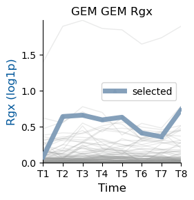
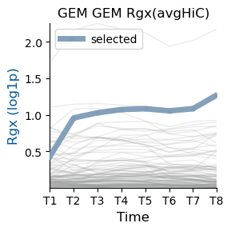
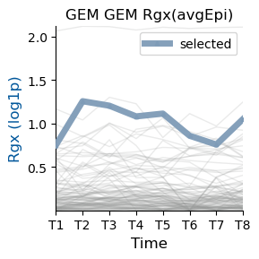
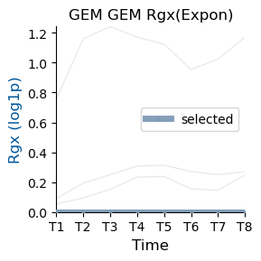
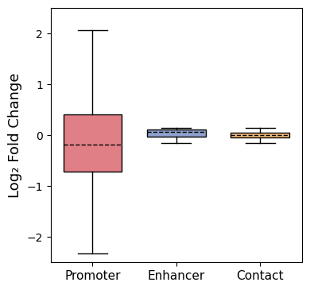
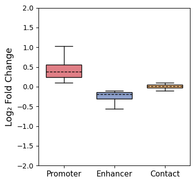
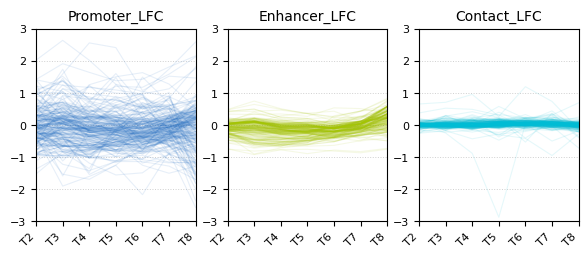
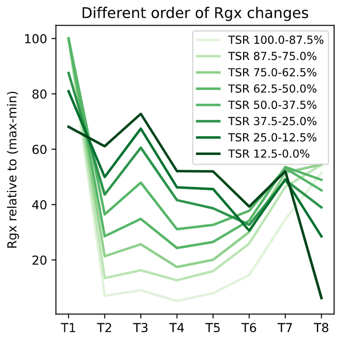
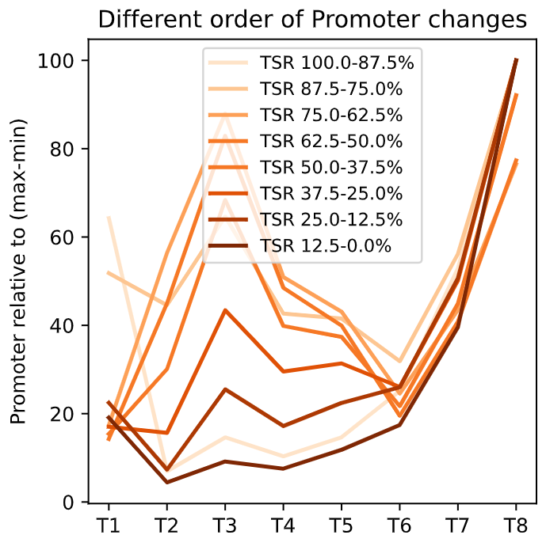

# 8. Reveal temporal transcriptional dynamics

**Tichr** can also be used to **reveal time-series transcriptional dynamics**.  
In this chapter, we demonstrate how to use the **Tichr** `timeSeries` module to perform **conflict gene analysis**, **differential gene expression analysis**, and **regulatory sequence analysis** for time-series epigenomic and 3D genome data across single, dual, and multiple time points.

Below, we provide an example illustrating how to apply the **Tichr** API for time-series data analysis.

---

## Single Gene Analysis
---
### Quick start

```python

from tichr.tichr import *
from tichr.timeSeries import *

datadir="./Data/TimeSeries"

GEM_RgxDfs = [
    f"{datadir}/GEM/GEM_Full_Rgx.tsv",
    f"{datadir}/GEM/GEN_onlyEpi_Rgx.tsv",
    f"{datadir}/GEM/GEN_only3D_Rgx.tsv",
    f"{datadir}/GEM/GEM_Expon_Rgx.tsv"
]
GEM_Rgx_lables = [
    "GEM Full",
    "GEM onlyEpi",
    "GEM only3D",
    "GEM Expon"
]
```
---

### Input file

**File requirements for Time-Series RgxDf**: The Time-Series `RgxDf` file must contain the following columns, where `t` is the number of time points.

- **column1**: site chromosome  
- **column2**: site start  
- **column3**: site end  
- **column4**: site epigenomic signal  
- **column5**: gene ID  
- **column6**: gene chromosome  
- **column7**: gene start  
- **column8**: gene end  
- **column9**: gene strand  
- **column10**: gene symbol  
- **column11–(10 + t)**: RgX values for each time point  
- **column(11 + t)**: target label (`N` / `Target`), represent the selected site-to-gene links

For example
| site_chr | site_start | site_end | epi_signal | gene_symbol | gene_chr | gene_start | gene_end | gene_id | T1 | T2 | T3 | T4 | T5 | T6 | T7 | T8 | Target |
|---------|------------|----------|------------|-------------|----------|------------|----------|---------|----|----|----|----|----|----|----|----|--------|
| chr8 | 94279465 | 94281465 | 3.6824 | GEM | chr8 | 95261481 | 95274578 | ENSG00000164949.7_2 | 0.0235 | 0.0953 | 0.0173 | 0.0000 | 0.0000 | 0.0553 | 0.0381 | 0.0512 | N |
| chr8 | 94314026 | 94316026 | 1.1253 | GEM | chr8 | 95261481 | 95274578 | ENSG00000164949.7_2 | 0.0000 | 0.0150 | 0.0143 | 0.0000 | 0.0000 | 0.0091 | 0.0201 | 0.0067 | N |
| chr8 | 94394902 | 94396902 | 0.3288 | GEM | chr8 | 95261481 | 95274578 | ENSG00000164949.7_2 | 0.0105 | 0.0104 | 0.0219 | 0.0121 | 0.0116 | 0.0074 | 0.0234 | 0.0096 | N |
| chr8 | 94409783 | 94411783 | 0.9086 | GEM | chr8 | 95261481 | 95274578 | ENSG00000164949.7_2 | 0.0000 | 0.0060 | 0.0000 | 0.0131 | 0.0000 | 0.0214 | 0.0043 | 0.0000 | N |
| chr8 | 94428194 | 94430194 | 2.7141 | GEM | chr8 | 95261481 | 95274578 | ENSG00000164949.7_2 | 0.0168 | 0.0191 | 0.0278 | 0.0364 | 0.0457 | 0.0494 | 0.0390 | 0.0538 | Target |
| chr8 | 94429624 | 94431624 | 7.7120 | GEM | chr8 | 95261481 | 95274578 | ENSG00000164949.7_2 | 0.2371 | 0.0760 | 0.0433 | 0.0316 | 0.0615 | 0.0000 | 0.0513 | 0.1404 | N |

---

### Visualize
You can display the trend of all Rgx for the target gene over time by the following codes, the target SiteToGene Pair will be highlighted:

```python
timepoint_counts = 8
outdir = "TimeSeries_GEM"

for file_path, ylabel in zip(GEM_RgxDfs, GEM_Rgx_lables):
    title = ylabel
    plot_one_gene(file_path, timepoint_counts, title, outdir=outdir)

```










--- 


## Two Timepoints Analysis
---
### Prepare package and data

```python
from tichr.tichr import *
from tichr.timeSeries import *

datadir="./Data/TimeSeries"
RgDfs = [
    f"{datadir}/THP1_H3K27ac_HiC/t0h_RP_RgDf.tsv",
    f"{datadir}/THP1_H3K27ac_HiC/t0.5h_RP_RgDf.tsv",
    f"{datadir}/THP1_H3K27ac_HiC/t1h_RP_RgDf.tsv",
    f"{datadir}/THP1_H3K27ac_HiC/t1.5h_RP_RgDf.tsv",
    f"{datadir}/THP1_H3K27ac_HiC/t2h_RP_RgDf.tsv",
    f"{datadir}/THP1_H3K27ac_HiC/t4h_RP_RgDf.tsv",
    f"{datadir}/THP1_H3K27ac_HiC/t6h_RP_RgDf.tsv",
    f"{datadir}/THP1_H3K27ac_HiC/t24h_RP_RgDf.tsv",
]

RgxDfs = [
    f"{datadir}/THP1_H3K27ac_HiC/t0h_RP_RgxDf.tsv",
    f"{datadir}/THP1_H3K27ac_HiC/t0.5h_RP_RgxDf.tsv",
    f"{datadir}/THP1_H3K27ac_HiC/t1h_RP_RgxDf.tsv",
    f"{datadir}/THP1_H3K27ac_HiC/t1.5h_RP_RgxDf.tsv",
    f"{datadir}/THP1_H3K27ac_HiC/t2h_RP_RgxDf.tsv",
    f"{datadir}/THP1_H3K27ac_HiC/t4h_RP_RgxDf.tsv",
    f"{datadir}/THP1_H3K27ac_HiC/t6h_RP_RgxDf.tsv",
    f"{datadir}/THP1_H3K27ac_HiC/t24h_RP_RgxDf.tsv",
]

#This is an optional feature to provide additional epigenetic data. 
#Here, we have incorporated the ​​epigenome signal of promoter regions​​.
promoter_twopoints_Df = f"{datadir}/THP1_H3K27ac_HiC/Promoter_EpigenomeSignal_TwoPoints.tsv"
promoter_eightpoints_Df = f"{datadir}/THP1_H3K27ac_HiC/Promoter_EpigenomeSignal_EightPoints.tsv"

```

The Rg and Rgx files are the `RgDf` and `RgxDf` obtained through Tichr `compute`.

The sample data for the subsequent **Multiple Timepoints Analysis** is the same as the data prepared here.

---
### Compute fold changes

Tichr provides an API to calculate the Log2 Fold Change (LFC) between the initial and final time points, enabling simultaneous computation of LFC for

1. Enhancer Epigenome Activity
2. Chromatin Contact Strength
3. Rgx Raw Value

Here is an example:

```python
resdf = lfc_two(RgxDfs[0], RgxDfs[-1], extra_df=promoter_twopoints_Df, extra_name="Promoter")
print(resdf.head(3))
```

| geneChr | geneStart | geneEnd | geneStrand |              geneID | geneSymbol | EnhancerLFC | ContactLFC |    RgxLFC | PromoterLFC |
| ------: | --------: | ------: | ---------: | ------------------: | ---------: | ----------: | ---------: | --------: | ----------: |
|    chr1 |     69091 |   70008 |          + | ENSG00000186092.4_1 |      OR4F5 |    0.363534 |   0.742941 | -0.394892 |   -0.955160 |
|    chr1 |    367640 |  368634 |          + |   ENSG00000235249.1 |     OR4F29 |    0.282767 |        NaN |       NaN |   -0.295193 |
|    chr1 |    621096 |  622034 |          - | ENSG00000273547.1_2 |     OR4F16 |    0.240425 |   1.624994 |  1.985691 |   -1.201738 |

---
### Change or Unchange Genes Analysis
> The comparison between two time points identified genes with minimal Rg fold-changes (< 0.15) as unchanged

By choosing a threshold, the `change_or_not` function can be used to classify genes into **changed** and **unchanged** groups.  
This analysis can be easily performed using the following code:

```python
names = [ "Promoter", "Enhancer", "Contact"]
change_marks = [True, False, False]
thresholds = [0.15, 0.15, 0.15]
outdir="TimeSeries_TwoPoints"

promoter_change_df = change_or_not(resdf, names, change_marks, thresholds=thresholds, 
                                    plot_it=True, ylim=(-2.5,2.5), outdir=outdir)
```

- **`resdf`**: pandas DataFrame obtained from previous analysis steps.
- **`names`**: Names of the target features.
- **`change_marks`**: A list indicating change status (`True` for changed, `False` for unchanged).
- **`thresholds`**: Threshold(s) used to determine whether a gene is classified as changed or unchanged.
- **`plot_it`**: Optional. Whether to generate a plot to visualize the results (default: `False`).
- **`outdir`**: Optional. Output directory for saving figures (default: `None`).
- **`ylim`**: Optional. y-axis limits for the plot (default: `[-2, 2]`).




---
### Conflict Genes Analysis

> Conflicting regulatory events were defined when two Rg features changed in opposite directions (e.g., promoter fold-changes<–0.15 vs. enhancer fold-changes>0.15), with the third feature unchanged (e.g., contact).

You can filter conflict genes by  `two_conflict`  function. Here is an example:

```python
names = [ "Promoter", "Enhancer", "Contact"]
change_marks = ["Up", "Down", "NoChange"]
thresholds = [0.1, 0.1, 0.1]
outdir="TimeSeries_TwoPoints"

promoter_change_df = two_conflict(resdf, names, change_marks, 
                                thresholds=thresholds, plot_it=True, outdir=outdir)

```

- **`resdf`**: pandas DataFrame obtained from previous analysis steps.
- **`names`**: Names of the target regulatory features.
- **`change_marks`**: A list specifying change directions:  
  `"Up"` for up-regulated, `"Down"` for down-regulated, `"NoChange"` for unchanged.
- **`thresholds`**: Thresholds used to determine whether each feature is regulated.
- **`plot_it`**: Optional. Whether to generate a plot to visualize the results (default: `False`).
- **`outdir`**: Optional. Output directory for saving figures (default: `None`).
- **`ylim`**: Optional. y-axis limits for the plot (default: `[-2, 2]`).




---

## Multiple Timepoints Analysis
---
### Prepare data

Data has been prepared in previous steps.

---
### Compute LFC

#### Descriptions

Tichr provides an API to simply merge different time points RgxDf, compute Enhancer, Contact, Rg value, and compute LFC value as output.

You can achieve it by following codes:

```python

lfc_df, lfc_cols_list = 
    lfc_multi(RgxDfs, extra_file=promoter_eightpoints_Df, extra_name="Promoter")

print(lfc_df.columns.tolist())

```

#### Parameters

- `RgxDfs`: a list of RgxDf files defined above.
- `extra_file`: optional. Use when you have data from other sources. Contains time-series data records. (Default: None)
- `extra_name`: optional. Feature name for extra file. (Defalule: None)


#### Output

This function will return a pandas `DataFrame` object containing LFC (Log Fold Change) values for each feature at each time point, along with a list of column names corresponding to the LFC values. 

The outputs will be used in subsequent steps. You can also directly use this `DataFrame` for personalized analysis.

```
['geneChr', 'geneStart', 'geneEnd', 'geneStrand', 'geneID', 'geneSymbol', 'Enhancer_LFC_T2', 'Enhancer_LFC_T3', 'Enhancer_LFC_T4', 'Enhancer_LFC_T5', 'Enhancer_LFC_T6', 'Enhancer_LFC_T7', 'Enhancer_LFC_T8', 'Contact_LFC_T2', 'Contact_LFC_T3', 'Contact_LFC_T4', 'Contact_LFC_T5', 'Contact_LFC_T6', 'Contact_LFC_T7', 'Contact_LFC_T8', 'Rgx_LFC_T2', 'Rgx_LFC_T3', 'Rgx_LFC_T4', 'Rgx_LFC_T5', 'Rgx_LFC_T6', 'Rgx_LFC_T7', 'Rgx_LFC_T8', 'Promoter_LFC_T2', 'Promoter_LFC_T3', 'Promoter_LFC_T4', 'Promoter_LFC_T5', 'Promoter_LFC_T6', 'Promoter_LFC_T7', 'Promoter_LFC_T8']
```
---
### Compute STS

> signal temporal score(STS) is an indicator for assessing the overall Regulatory Potential (RP) strength of time-series data. 

Tichr provides an API `steady_total_strength` to calculate this metric. Here is an example:

```python
features = ["Enhancer", "Contact", "Rgx", "Promoter"]
sts_df = compute_sts(lfc_df, features, lfc_cols_list)
print(sts_df.columns.tolist())
```
parameters:

- `lfc_df`: get from `lfc_multi_timepoints` function
- `features`: a list of feature names
- `lfc_cols_list`: get from `lfc_multi_timepoints` function

This function returns a pandas DataFrame object containing STS values. It can be used as input for `multi_points_change` or for other customized analyses.

```
['geneChr', 'geneStart', 'geneEnd', 'geneStrand', 'geneID', 'geneSymbol', 'Enhancer_LFC_T2', 'Enhancer_LFC_T3', 'Enhancer_LFC_T4', 'Enhancer_LFC_T5', 'Enhancer_LFC_T6', 'Enhancer_LFC_T7', 'Enhancer_LFC_T8', 'Contact_LFC_T2', 'Contact_LFC_T3', 'Contact_LFC_T4', 'Contact_LFC_T5', 'Contact_LFC_T6', 'Contact_LFC_T7', 'Contact_LFC_T8', 'Rgx_LFC_T2', 'Rgx_LFC_T3', 'Rgx_LFC_T4', 'Rgx_LFC_T5', 'Rgx_LFC_T6', 'Rgx_LFC_T7', 'Rgx_LFC_T8', 'Promoter_LFC_T2', 'Promoter_LFC_T3', 'Promoter_LFC_T4', 'Promoter_LFC_T5', 'Promoter_LFC_T6', 'Promoter_LFC_T7', 'Promoter_LFC_T8', 'Enhancer_STS', 'Contact_STS', 'Rgx_STS', 'Promoter_STS']
```

---

### Change Or Unchanged gene Analysis

You can filter changed genes and no-change genes by setting a threshold for the STS value.Tichr provides an API `multi_points_change` to facilitate convenient implementation of this functionality.

Here is an example to show Promoter-Change; Enhancer-NoChange; Contact NoChange genes.

```
features = [ "Promoter", "Enhancer", "Contact"]
change_marks = [True, False, False]
thresholds = [0.1, 0.1, 0.1]
times = ["T2", "T3", "T4", "T5", "T6", "T7", "T8"]
multi_points_change(sts_df, features, change_marks, thresholds, times, plotit=True)  

```




---

### Early Or Late change Analysis

> To determine the order of transcriptional and chromatin changes, a Total Strength Ratio (TSR) was computed to describe the sequence of changes. 

Tichr can also be used to distinguish between Early Regulated Genes (ERGs) and Late Regulated Genes (LRGs). TSR (Total Strength Ratio) is a metric designed to evaluate the chronological order of changes in gene Rg values. Tichr provides an API to compute and visualize TSR:

```python
resdf = compute_tsr(RgxDfs, extra_file=promoter_eightpoints_Df, 
                    extra_name="Promoter", plotit=True, 
                    times=["T1", "T2", "T3", "T4", "T5", "T6", "T7", "T8"])
```

This function will return a pandas `DataFrame` object containing TSR values and output some images to demonstrate the classification performance of TSR：



