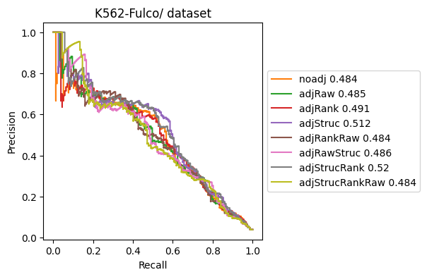
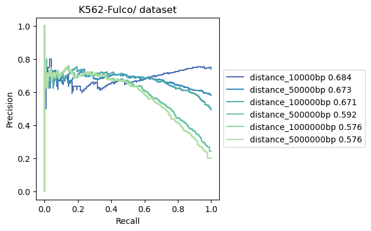
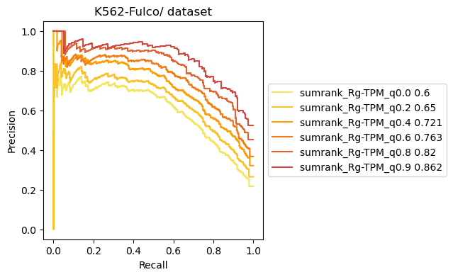
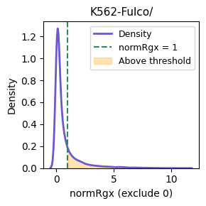
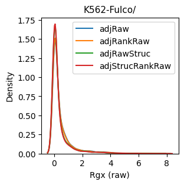
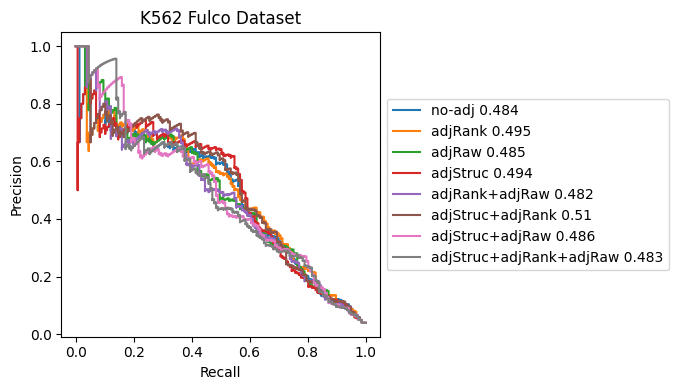

# Adjust Rgx and show the performance

## Adjust for all RgX

``` python
import sys
sys.path.append('/home/wang/github/Tichr-CLI/tichr')
from tichr import *
from adjustRgx import *
```

#### Prepare Rgx and Rg file that are directedly generated by Tichr

``` python
tichr_obj_noquantile = Tichr(candidatesite,[bamfile1,bamfile2],gtfile,
                  candidategene,refgene_file=referencegene,
                    ifTSSrange=500,peakToGeneMaxDistance=500000,
                  hicfilepath=rawhic,readFileList2=[bamfile3,])

tichr_obj_noquantile.makeSiteBed(macs2species='hs',binResolution=100,tmpdir='tmp_K562fulco')
tichr_obj_noquantile.makeSiteBdg("coverageBed",spmr = False)

tichr_obj_noquantile.hicfilepath="/home/common/rawdata/Hi-C_juicer_file/K562/ENCFF621AIY/ENCFF621AIY.hic"
tichr_obj_noquantile.proceessHiC(25000,"rawhic_sparse","VC_SQRT",further_normalize_type='no_further',threads=12)
tichr_obj_noquantile.computeAllGene("hic",ifUseHiCRef=False)

predictdfname= "noStructure"
tichr_obj_noquantile.RgxDf.to_csv("resultdf_Fulco_2025/"+predictdfname+"_Rgx_beforematch.tsv",
                                  index=None,sep="\t")
tichr_obj_noquantile.RgDF.to_csv("resultdf_Fulco_2025/"+predictdfname+"_Rg_beforematch.tsv",index=None,sep="\t")

```

``` python
rgxfile_raw="/home/wang/Tichr/2024Aug/tryTADetc/resultdf_Fulco_2025/noStructure_Rgx_beforematch.tsv"
rgfile_raw="/home/wang/Tichr/2024Aug/tryTADetc/resultdf_Fulco_2025/noStructure_Rg_beforematch.tsv"
outdir = "K562-Fulco/"
```

#### Prepare gold df

``` python
#golddf = "/home/wang/Tichr/datahub/EPinter/EP_CRISPRi_screens/hg38/Fulco_interactions_wScore.txt"
golddf ="Fulco_interactions_wScore.nohead.tsv"
goldwithhead=False
goldcol=4
truecol=5
matchcol=14
```

The golddf need to be the following style:
- site chr
- site start
- site end
- gene ID (`goldcol`)
- Column number for True or False to be a real site-to-gene links (`truecol`)
- `matchcol`, column number for the matched Rgx, usually the column number of golddf+1

#### Prepare gene TPM file

``` python 
tpmfile="/home/wang/Tichr/datahub/EPinter/K562_NT_H3K27ac+DNase/RNAseq/Matrix_edgeR/K562.genes.TPM.txt"
tmpcolrep=[3,4,]
ignorehead=True
tmpgeneID=2
```

#### Prepare sturcture file

``` python
structureTypeList = ["boundary","tad","loop","stripe","compartmentSame"]
structureFileList = [
    "/home/wang/Tichr/datahub/EPdata/K562/ENCFF621AIY/tad.boundary.point",
    "/home/wang/Tichr/datahub/EPdata/K562/ENCFF621AIY/tad.region",
    "/home/wang/Tichr/datahub/EPdata/K562/ENCFF621AIY/loop.bedpe",
    "/home/wang/Tichr/datahub/EPdata/K562/ENCFF621AIY/stripe.bedpe",
    "/home/wang/Tichr/datahub/EPdata/K562/ENCFF621AIY/pc1.compart",
                    ]
structureWeightList = [0.5,1.2,5,2,2]

```


#### plot all combinations

``` python
outdir = "K562-Fulco/"
allcombination(rgxfile_raw,rgfile_raw,
                golddf,goldcol,outdir,tpmfile,
                structureTypeList,structureFileList,structureWeightList,
                matchcol=matchcol,truecol=truecol,goldwithhead=goldwithhead,
                tmpcolrep=tmpcolrep,ignorehead=ignorehead,tmpgeneID=tmpgeneID,
                ranktype="sumrank",onlyPlot=False)

```




#### predict EP by different distance
``` python
diffrentThresh(rgxfile_raw,rgfile_raw,golddf,goldcol,outdir,tpmfile,
                threshType="distance",threshList=[10000,50000,100000,500000,1000000,5000000],
                tmpcolrep=[3,4,],rggeneID=5,tmpgeneID=2,rgxgeneID=10,
                matchcol=matchcol,truecol=truecol,goldwithhead=goldwithhead,onlyPlot=False)
```



#### predict EP by different gene TPM
``` python
diffrentThresh(rgxfile_raw,rgfile_raw,golddf,goldcol,outdir,tpmfile,
                threshType="tpm",threshList=[0.0,0.2,0.4,0.6,0.8,0.9],
                tmpcolrep=[3,4,],rggeneID=5,tmpgeneID=2,rgxgeneID=10,
                matchcol=matchcol,truecol=truecol,goldwithhead=goldwithhead,onlyPlot=False)
```


#### predict EP by different trends between Rgx and gene expression
``` python
diffrentThresh(rgxfile_raw,rgfile_raw,golddf,goldcol,outdir,tpmfile,
                threshType="tpm",threshList=[0.0,0.2,0.4,0.6,0.8,0.9],
                tmpcolrep=[3,4,],rggeneID=5,tmpgeneID=2,rgxgeneID=10,
                matchcol=matchcol,truecol=truecol,goldwithhead=goldwithhead,onlyPlot=False)
```




#### Choose threshold for Rgx

``` python
plotdensity(rgxfile_raw,outdir,matchedwithhead = goldwithhead,matchcol=matchcol,truecol=truecol)
```





--------------------

## (Archived) adjust after matching true label

This is a old method, two points are important:
- adjust structure before calculating RgX
- adjust gene TPM after calculateing Rgx and matching to the real value

### Prepare input data

``` python
import sys
sys.path.append('/home/wang/github/Tichr-CLI/tichr')
from tichr import *
from adjustRgx_old import *

candidategene="/home/wang/Tichr/2024June/predictEP_Fulco/candidate_gene.bed"
referencegene = '/home/wang/Tichr/2024June/predictEP_Fulco/referencegene.bed'
candidatesite="/home/wang/Tichr/2024May/K562_knownEP/Fulco/allsite/hg38_FulcoCandidates.bed"
golddf = "/home/wang/Tichr/datahub/EPinter/EP_CRISPRi_screens/hg38/Fulco_interactions_wScore.txt"

bamfile1="/home/wang/Tichr/datahub/EPinter/K562_NT_H3K27ac+DNase/DNase/hg38_wgEncodeUwDnaseK562AlnRep1.sorted.bam"
bamfile2 = "/home/wang/Tichr/datahub/EPinter/K562_NT_H3K27ac+DNase/DNase/hg38_wgEncodeUwDnaseK562AlnRep2.sorted.bam"
bamfile3 = "/home/wang/Tichr/datahub/EPinter/K562_NT_H3K27ac+DNase/ENCFF600THN.bam"

gtfile="/home/wang/database/hg38/genometable_all.txt"
rawhic="/home/common/rawdata/Hi-C_juicer_file/K562/ENCFF621AIY/ENCFF621AIY.hic"
gt="~/database/hg38/genome_table"

```

### Calculate Rgx without any adjustment

``` python
tichr_obj_noquantile = Tichr(candidatesite,[bamfile1,bamfile2],gtfile,
                  candidategene,refgene_file=referencegene,
                    ifTSSrange=500,peakToGeneMaxDistance=500000,
                  hicfilepath=rawhic,readFileList2=[bamfile3,])

tichr_obj_noquantile.makeSiteBed(macs2species='hs',binResolution=100,tmpdir='tmp_K562fulco')
tichr_obj_noquantile.makeSiteBdg("coverageBed",spmr = False)

tichr_obj_noquantile.hicfilepath="/home/common/rawdata/Hi-C_juicer_file/K562/ENCFF621AIY/ENCFF621AIY.hic"
tichr_obj_noquantile.proceessHiC(25000,"rawhic_sparse","VC_SQRT",further_normalize_type='no_further',threads=12)
tichr_obj_noquantile.computeAllGene("hic",ifUseHiCRef=False)

predictdfname= "noStructure"
tichr_obj_noquantile.RgxDf.to_csv("resultdf_Fulco_2025/"+predictdfname+"_Rgx_beforematch.tsv",
                                  index=None,sep="\t")
tichr_obj_noquantile.RgDF.to_csv("resultdf_Fulco_2025/"+predictdfname+"_Rg_beforematch.tsv",index=None,sep="\t")

```

### Calculate Rgx with structure adjustment

``` python

structureTypeList = ["boundary","tad","loop","stripe","compartmentSame"]
structureFileList = [
    "/home/wang/Tichr/datahub/EPdata/K562/ENCFF621AIY/tad.boundary.point",
    "/home/wang/Tichr/datahub/EPdata/K562/ENCFF621AIY/tad.region",
    "/home/wang/Tichr/datahub/EPdata/K562/ENCFF621AIY/loop.bedpe",
    "/home/wang/Tichr/datahub/EPdata/K562/ENCFF621AIY/stripe.bedpe",
    "/home/wang/Tichr/datahub/EPdata/K562/ENCFF621AIY/pc1.compart",
                    ]
structureWeightList = [0.5,1.2,5,2,2
                       
tichr_obj_noquantile.weightStructure(structureTypeList,structureFileList,structureWeightList)
tichr_obj_noquantile.computeAllGene("hic",ifUseHiCRef=False)

predictdfname= "combine5"
tichr_obj_noquantile.RgxDf.to_csv("resultdf_Fulco_2025/"+predictdfname+"_Rgx_beforematch.tsv",
                                  index=None,sep="\t")
tichr_obj_noquantile.RgDF.to_csv("resultdf_Fulco_2025/"+predictdfname+"_Rg_beforematch.tsv",
                                  index=None,sep="\t")

```

### Matching truelabel and plot

The golddf need to be the following style:
- site chr
- site start
- site end
- gene ID (goldcol)
- True or False to be a real site-to-gene links (truecol)


``` python

rgxdir="resultdf_Fulco_2025/"
golddf = "/home/wang/Tichr/datahub/EPinter/EP_CRISPRi_screens/hg38/Fulco_interactions_wScore.txt"
outdir = "K562fulco/"
tpmfile="/home/wang/Tichr/datahub/EPinter/K562_NT_H3K27ac+DNase/RNAseq/Matrix_edgeR/K562.genes.TPM.txt"


compareAdjust(rgxdir,golddf,outdir,tpmfile,tpmcol=[2,3],goldcol=4,title="K562 Fulco Dataset",
             if1stmatch=False,adjtype="sumrank")

```


