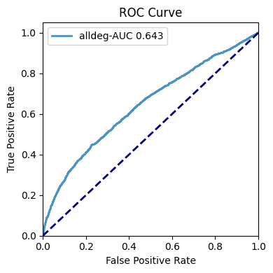
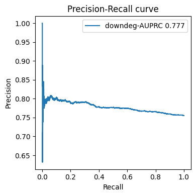
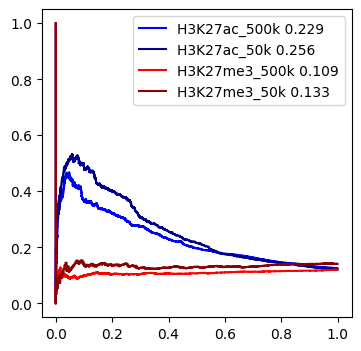

# Study DEGs

## Predict DEGs

### prepare tichr results for control and treat samples.

Four files are needed for this analysis: RgDF and RgxDF for control and treat sample ,repescitively

``` python
import sys
sys.path.append('/home/wang/github/Tichr-CLI/tichr')
from tichr import *
from studyDEG import *

RgDF_Ctrl_file = "auprcdata/Control_H3K27ac_RgDf.tsv"
RgxDF_Ctrl_file = "auprcdata/Control_H3K27ac_RgxDf.tsv"
RgDF_Treat_file = "auprcdata/siNIPBL_H3K27ac_RgDf.tsv"
RgxDF_Treat_file = "auprcdata/siNIPBL_H3K27ac_RgxDf.tsv"
```

File requirement for RgDf
- column1: gene chr
- column2: gene star
- column3: gene end
- column4: gene ID
- column5: gene symbol
- column6: gene strand
- column7: gene Fold change
- column8: gene FDR
- column9: gene TPM (average of treat and ctrl)
- column10: gene Rg score

File requirment for RgxDf
- column1: site chr
- column2: site start
- column3: site end
- column4: site epigenome signal
- column5: gene ID
- column6: gene chr
- column7: gene start
- column8: gene end
- column9: gene strand
- column10: gene symbol
- column11: site-to-gene weight
- column12: Rgx score
- column13: Rgx ratio

### predict DEGs 
``` python
diffobj = DiffEvent(RgDF_Ctrl_file,RgxDF_Ctrl_file,RgDF_Treat_file,RgxDF_Treat_file,
                   maxdistance=500000)
diffobj.predictDEG(type="ROC",label="alldeg-AUC",degtype='all')
```


- `type`: could be PRC or ROC
- `label`: label for the examination
- `degtype`: predict 'all', 'up' or 'down' DEGs

``` python
diffobj.predictDEG(type="PRC",label="downdeg-AUPRC",degtype='down')
```



You can also draw multiple curve in the same plot. It could be different data source or different parameters in Tichr.

``` python
RgDF_Ctrl_file = "auprcdata/Control_H3K27ac_RgDf.tsv"
RgxDF_Ctrl_file = "auprcdata/Control_H3K27ac_RgxDf.tsv"
RgDF_Treat_file = "auprcdata/siNIPBL_H3K27ac_RgDf.tsv"
RgxDF_Treat_file = "auprcdata/siNIPBL_H3K27ac_RgxDf.tsv"
diffobj1 = DiffEvent(RgDF_Ctrl_file,RgxDF_Ctrl_file,RgDF_Treat_file,RgxDF_Treat_file,
                   maxdistance=500000)

RgDF_Ctrl_file = "auprcdata/Control_H3K27ac_RgDf.tsv"
RgxDF_Ctrl_file = "auprcdata/Control_H3K27ac_RgxDf.tsv"
RgDF_Treat_file = "auprcdata/siNIPBL_H3K27ac_RgDf.tsv"
RgxDF_Treat_file = "auprcdata/siNIPBL_H3K27ac_RgxDf.tsv"
diffobj2 = DiffEvent(RgDF_Ctrl_file,RgxDF_Ctrl_file,RgDF_Treat_file,RgxDF_Treat_file,
                   maxdistance=50000)

RgDF_Ctrl_file = "auprcdata/Control_H3K27me3_RgDf.tsv"
RgxDF_Ctrl_file = "auprcdata/Control_H3K27me3_RgxDf.tsv"
RgDF_Treat_file = "auprcdata/siNIPBL_H3K27me3_RgDf.tsv"
RgxDF_Treat_file = "auprcdata/siNIPBL_H3K27me3_RgxDf.tsv"
diffobj3 = DiffEvent(RgDF_Ctrl_file,RgxDF_Ctrl_file,RgDF_Treat_file,RgxDF_Treat_file,
                     maxdistance=500000)

RgDF_Ctrl_file = "auprcdata/Control_H3K27me3_RgDf.tsv"
RgxDF_Ctrl_file = "auprcdata/Control_H3K27me3_RgxDf.tsv"
RgDF_Treat_file = "auprcdata/siNIPBL_H3K27me3_RgDf.tsv"
RgxDF_Treat_file = "auprcdata/siNIPBL_H3K27me3_RgxDf.tsv"
diffobj4 = DiffEvent(RgDF_Ctrl_file,RgxDF_Ctrl_file,RgDF_Treat_file,RgxDF_Treat_file,
                     maxdistance=50000)
```

`custome` should be True and linecolor should be specified 

``` python
plt.figure(figsize=(4,4))
diffobj1.predictDEG(label="H3K27ac_500k",custom=True,linecolor="blue")
diffobj2.predictDEG(label="H3K27ac_50k",custom=True,linecolor="darkblue")
diffobj3.predictDEG(label="H3K27me3_500k",custom=True,linecolor="red")
diffobj4.predictDEG(label="H3K27me3_50k",custom=True,linecolor="darkred")
plt.legend()
plt.show()
```

The output is like


