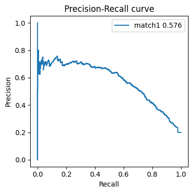

# Analyze RgX and Rg by predict EP or DEGs

## Predict E-P
To predict E-P interactions, you must have a gold standard for benchmarking the rgx results. You can possiblly use the promoter-capture Hi-C, or other related methods to get the correct data

### Prepare gold df

``` python
golddf="auprcdata/K562_gold_label.tsv"
goldcol =10
truecol = 12
withhead=False
```

The golddf need to be the following style (either with column title or not is allowed):
- 1st column: site chr
- 2nd column: site start
- 3rd column: site end
- `goldGeneCol`: Column number for the gene ID in golddf, this should be matched to the Rgx gene ID.
- `truecol`: Column number for True or False (or 0/1) to be a real site-to-gene links.
- `withhead`: If the gold df have column title or not.

An example file is
| peakChr | peakStart | peakEnd | peakID        | peakType       | geneChr | geneStart | geneEnd | transcriptID       | geneID            | geneStrand | weight |
|---------|-----------|---------|----------------|----------------|---------|-----------|---------|---------------------|--------------------|-------------|--------|
| chr7    | 100694352 | 100694774 | EH37E0917456   | Enhancer-like  | chr7    | 100689448 | 100689448 | ENST00000275732.5   | ENSG00000146830  | -           | 1      |
| chr7    | 100694352 | 100694774 | EH37E0917456   | Enhancer-like  | chr7    | 100351256 | 100351256 | ENST00000472646.1   | ENSG00000272752  | +           | 0      |
| chr7    | 100694352 | 100694774 | EH37E0917456   | Enhancer-like  | chr7    | 100656461 | 100656461 | ENST00000160382.5   | ENSG00000077080  | -           | 0      |


### Prepare Rgx file
Use the standard Rgx format. Columns name should be kept.
File requirment for RgxDf
- column1: site chr 
- column2: site start 
- column3: site end
- column4: site epigenome signal
- column5: gene ID
- column6: gene chr
- column7: gene start
- column8: gene end
- column9: gene strand
- column10: gene symbol
- column11: site-to-gene weight
- column12: Rgx score
- column13: Rgx ratio

A example Rgx file obtained from Tichr:

| peakChr | peakStart | peakEnd | epigenomeActivity     | geneSymbol          | geneChr | geneStart | geneEnd | geneStrand | geneID             | weight | Rgx_rawvalue | Rgx_percent |
|---------|-----------|---------|------------------------|----------------------|---------|-----------|---------|-------------|---------------------|--------|---------------|--------------|
| chr1    | 20290552  | 20291052| 0.26389441413565384    | ENST00000568195.1    | chr1    | 25272548  | 25272548| +           | ENSG00000187010.14  | 0.0    | 0.0           | 0.0          |
| chr1    | 20308450  | 20308950| 0.24814898809465255    | ENST00000568195.1    | chr1    | 25272548  | 25272548| +           | ENSG00000187010.14  | 0.0    | 0.0           | 0.0          |
| chr1    | 20328146  | 20328646| 0.2605078694176051     | ENST00000568195.1    | chr1    | 25272548  | 25272548| +           | ENSG00000187010.14  | 0.0    | 0.0           | 0.0          |


### Match the Rgx to the gold df 

``` python
matched = matchgold(rgxfile,golddf,outname,goldGeneCol,
          percent=False,withhead=withhead,returnDF=True)
```
`percent`: default False means using the rgx raw value. If it is True, use Rgx ratio instead of Rgx value
`withhead`: if the golddf have column names
`returnDF`: let it be True.

PRC curve
``` python
showAUPRC(matched[truecol-1],matched.iloc[:,-1],"match1",)
```


ROC curve
``` python
showROC(matched[truecol-1],matched.iloc[:,-1],"match1",)
```


or you can assign color, figure title and many things by your self.
``` python
#PRC
plt.title("test title")
pltoneprc(matched[truecol-1],matched.iloc[:,-1],"match1","green")
plt.show()
#ROC
pltoneroc(matched[truecol-1],matched.iloc[:,-1],"match1","green")
plt.show()

```

### plot multiple PRC curves

When you have multiple Rgx file, for example, generated by various data, or by different tichr parameters, you can show them together

``` python
matched2 = matchgold("auprcdata/K562_RgxDF_type2.tsv",golddf,outname,goldGeneCol,
          percent=False,withhead=withhead,returnDF=True)

matched3 = matchgold("auprcdata/K562_RgxDF_type3.tsv",golddf,outname,goldGeneCol,
          percent=False,withhead=withhead,returnDF=True)
```

Plot them together

```
showAUPRC(matched[truecol-1],matched.iloc[:,-1],"match1",
         matched2[truecol-1],matched2.iloc[:,-1],"match2",
         matched3[truecol-1],matched3.iloc[:,-1],"match3",)
```


``` python
showROC(matched[truecol-1],matched.iloc[:,-1],"match1",
         matched2[truecol-1],matched2.iloc[:,-1],"match2",
         matched3[truecol-1],matched3.iloc[:,-1],"match3",)
```


## Predict DEGs

### prepare tichr results for control and treat samples.

Four files are needed for this analysis: RgDF and RgxDF for control and treat sample ,repescitively

``` python
import sys
sys.path.append('/home/wang/github/Tichr-CLI/tichr')
from tichr import *
from studyDEG import *

RgDF_Ctrl_file = "auprcdata/Control_H3K27ac_RgDf.tsv"
RgxDF_Ctrl_file = "auprcdata/Control_H3K27ac_RgxDf.tsv"
RgDF_Treat_file = "auprcdata/siNIPBL_H3K27ac_RgDf.tsv"
RgxDF_Treat_file = "auprcdata/siNIPBL_H3K27ac_RgxDf.tsv"
```

File requirement for RgDf
- column1: gene chr
- column2: gene star
- column3: gene end
- column4: gene ID
- column5: gene symbol
- column6: gene strand
- column7: gene Fold change
- column8: gene FDR
- column9: gene TPM (average of treat and ctrl)
- column10: gene Rg score

File requirment for RgxDf
- column1: site chr
- column2: site start
- column3: site end
- column4: site epigenome signal
- column5: gene ID
- column6: gene chr
- column7: gene start
- column8: gene end
- column9: gene strand
- column10: gene symbol
- column11: site-to-gene weight
- column12: Rgx score
- column13: Rgx ratio

### predict DEGs 
``` python
diffobj = DiffEvent(RgDF_Ctrl_file,RgxDF_Ctrl_file,RgDF_Treat_file,RgxDF_Treat_file,
                   maxdistance=500000)
diffobj.predictDEG(type="ROC",label="alldeg-AUC",degtype='all')
```


- `type`: could be PRC or ROC
- `label`: label for the examination
- `degtype`: predict 'all', 'up' or 'down' DEGs

``` python
diffobj.predictDEG(type="PRC",label="downdeg-AUPRC",degtype='down')
```


You can also draw multiple curve in the same plot. It could be different data source or different parameters in Tichr.

``` python
RgDF_Ctrl_file = "auprcdata/Control_H3K27ac_RgDf.tsv"
RgxDF_Ctrl_file = "auprcdata/Control_H3K27ac_RgxDf.tsv"
RgDF_Treat_file = "auprcdata/siNIPBL_H3K27ac_RgDf.tsv"
RgxDF_Treat_file = "auprcdata/siNIPBL_H3K27ac_RgxDf.tsv"
diffobj1 = DiffEvent(RgDF_Ctrl_file,RgxDF_Ctrl_file,RgDF_Treat_file,RgxDF_Treat_file,
                   maxdistance=500000)

RgDF_Ctrl_file = "auprcdata/Control_H3K27ac_RgDf.tsv"
RgxDF_Ctrl_file = "auprcdata/Control_H3K27ac_RgxDf.tsv"
RgDF_Treat_file = "auprcdata/siNIPBL_H3K27ac_RgDf.tsv"
RgxDF_Treat_file = "auprcdata/siNIPBL_H3K27ac_RgxDf.tsv"
diffobj2 = DiffEvent(RgDF_Ctrl_file,RgxDF_Ctrl_file,RgDF_Treat_file,RgxDF_Treat_file,
                   maxdistance=50000)

RgDF_Ctrl_file = "auprcdata/Control_H3K27me3_RgDf.tsv"
RgxDF_Ctrl_file = "auprcdata/Control_H3K27me3_RgxDf.tsv"
RgDF_Treat_file = "auprcdata/siNIPBL_H3K27me3_RgDf.tsv"
RgxDF_Treat_file = "auprcdata/siNIPBL_H3K27me3_RgxDf.tsv"
diffobj3 = DiffEvent(RgDF_Ctrl_file,RgxDF_Ctrl_file,RgDF_Treat_file,RgxDF_Treat_file,
                     maxdistance=500000)

RgDF_Ctrl_file = "auprcdata/Control_H3K27me3_RgDf.tsv"
RgxDF_Ctrl_file = "auprcdata/Control_H3K27me3_RgxDf.tsv"
RgDF_Treat_file = "auprcdata/siNIPBL_H3K27me3_RgDf.tsv"
RgxDF_Treat_file = "auprcdata/siNIPBL_H3K27me3_RgxDf.tsv"
diffobj4 = DiffEvent(RgDF_Ctrl_file,RgxDF_Ctrl_file,RgDF_Treat_file,RgxDF_Treat_file,
                     maxdistance=50000)
```

`custome` should be True and linecolor should be specified 

``` python
plt.figure(figsize=(4,4))
diffobj1.predictDEG(label="H3K27ac_500k",custom=True,linecolor="blue")
diffobj2.predictDEG(label="H3K27ac_50k",custom=True,linecolor="darkblue")
diffobj3.predictDEG(label="H3K27me3_500k",custom=True,linecolor="red")
diffobj4.predictDEG(label="H3K27me3_50k",custom=True,linecolor="darkred")
plt.legend()
plt.show()
```

The output is like


