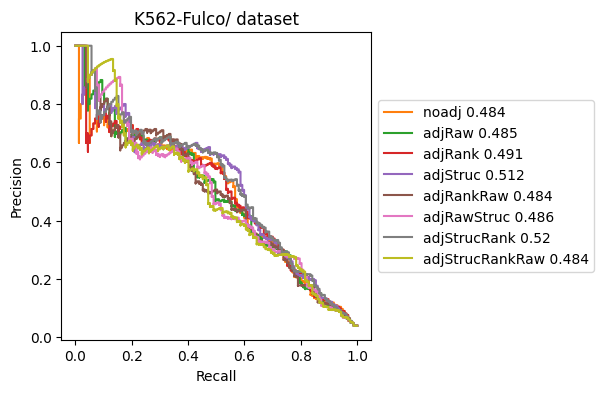
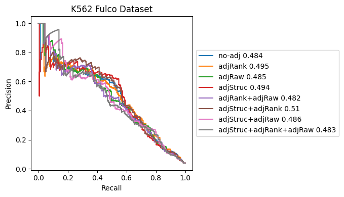

# Compute

This page provide necessary steps to obtain Rg for each gene, and Rgx for each site-to-gene links.

## A quick start

TICHR integrates epigenomic signals, chromatin 3D interaction, and gene annotation to quantify regulatory potential (Rg) of each gene and regulatory strength (Rgx) of each candidate site-to-gene link by combining ChIP-seq/ATAC-seq coverage with Hi-C contact data, enabling genome-wide inference of transcriptional regulation.

These commands will generate two output files containing the gene regulatory potential (Rg) and site-to-gene regulatory strength (RgX) values, respectively.

``` python
RPobj = Tichr(candidateSite,[bam,],gtfile,genebedfile,refgene_file=genebedfile,peakToGeneMaxDistance=5000000)
RPobj.makeSiteBed()
RPobj.makeSiteBdg("coverageBed",spmr = True)
RPobj.hicfilepath = hic_file
RPobj.proceessHiC(25000,'rawhic_sparse',"VC_SQRT",
                    threads=12,further_normalize_type='no_further')
RPobj.computeAllGene("hic")
RPobj.RgxDf.to_csv("resultdf/"+name+"_RP_RgxDf.tsv",header=None,sep="\t",index=None)
RPobj.RgDF.to_csv("resultdf/"+name+"_RP_RgDf.tsv",header=None,sep="\t",index=None)
```
------

## Step1. Create Tichr object

Tichr is flexible for various input formats and research purposes. The following section lists the typical input files required.

``` python
candidatesite="testdata/candidatePeak.bed"
candidateGeneFile="testdata/candidateGene.tsv"
DNase_rep1="testdata/DNase_rep1.bam"
DNase_rep2="testdata/DNase_rep2.bam"
readFileList=[DNase_rep1,DNase_rep2,]
gtfile="testdata/hg38_gt.tsv"

refgene_file="testdata/all_coding_gene.tsv"
H3K27ac="testdata/H3K27ac.bam"
readFileList2=[H3K27ac,]
hicfilepath="testdata/ENCFF621AIY.hic"

tichrobj = Tichr(candidatesite,readFileList,gtfile,candidateGeneFile,refgene_file=refgene_file,
                 ifTSSrange=500,peakToGeneMaxDistance=100000,
                 hicfilepath=hicfilepath,readFileList2=readFileList2)

```

**Required parameters**
- `candidatesite`: Candidate regulatory sites, this could be a BED3 file (e.g, `"testdata/candidatePeak.bed"`), or a predefined type specified by a string: `"denovo_peak"`,`"surronding_bin"`,`"onlypromoter"`. type=str,default="onlypromoter". see [below](#step2-generate-candidate-sites
) 
- `readFileList`: A list of input files for epigenomic data such as ChIP-seq, ATAC-seq, or CUT&Tag. Supported formats include BAM, BigWig, and BedGraph. Multiple files should be provided as a list, e.g., `["testdata/DNase_rep1.bam","testdata/DNase_rep2.bam"]`
- `gtfile`: A tab-separated genome table file, with column 1 specifying chromosome names and column 2 indicating chromosome lengths.
- `candidateGeneFile`: A tab-separated file listing candidate genes. It must contain at least six columns in the following order: [chromosome, start, end, gene symbol, gene ID, strand (+/-)].

**Optional parameters**
- `refgene_file`:  Reference gene file in the same format as `candidateGeneFile`. This file is used to define gene promoter regions. Typically, it can be the same as `candidateGeneFile`. 
- `ifTSSrange`: Defines the promoter region as transcription start site (TSS) ± this range. Type: int. Default: 500.
- `peakToGeneMaxDistance`: Maximum distance (in base pairs) allowed between a peak and a gene for linking. Type: int. Default: 100000. A large value will generate a longer calculation time and the size of output files. For most case, 500000 (500kb) is recommended.
- `hicfilepath`: Path to hic files in Juicer `.hic` format. 
- `readFileList2`:  A second set of epigenome data files, in the same format as readFileList. For example, DNase signals can be provided in readFileList and H3K27ac signals in readFileList2. These two signals are combined using the geometric mean

------

## Step2. Generate candidate sites

``` python
encodeblack="testdata/hg38-blacklist.v2.bed"
tichrobj.makeSiteBed(macs2species='hs',binResolution=100,
                blackregion=encodeblack,tmpdir=None,fixPeakWidth=False)
```

A list of putative regions can be generated automatically, or supplied by the users. 
> 1. `path-to-BED3-file`: User BED input: User-supplied BED regions were  resized to 500 bp around centered windows and filtered to remove blacklisted regions.
> 2. `"denovo_peak"`: De novo peaks: Peaks were called from input BAM files, with blacklisted regions excluded.
> 3. `"surronding_bin"`: Surrounding bins: Fixed-size genomic bins (e.g., 100 bp) were tiled around gene TSSs based on annotation.
> 4. `"onlypromoter"`: Promoter-only: ±100 bp regions centered on the TSS.

- `macs2species`: Used only when `candidateSite` is set to `"denovo_peak"`. Specifies the effective genome size for MACS2 peak calling. It can be a numeric value (e.g., 1000000000) or a shortcut string ('hs' for human, 'mm' for mouse, 'ce' for C. elegans, 'dm' for Drosophila). Default is "hs". Type: str, default: "hs".
- `binResolution`: Used only when candidateSite is set to "surronding_bin". Defines the bin size (in base pairs) for creating windowed candidate sites. Default: 100.
- `fixPeakWidth`: Applicable only for given `BED3` candidate sites. If set to True, each peak’s width is fixed to 500 bp by centering and extending ±250 bp.
- `blackregion`: Regions to exclude, such as ENCODE blacklist sites, provided in Bed3 format.
- `tmpdir`: Temporary directory name for intermediate files. Default is a randomly generated name like tichr_tmp_rsDuchihKJ.

<div style="padding: 15px; border: 1px solid transparent; border-color: transparent; margin-bottom: 20px; border-radius: 10px; color: #000000ff;; background-color: #b5cabaff; border-color: #faebcc;">
You can check the generated sites file via the attribute `tichrobj.candidatesite_file`.
</div>

---

## Step3. Quantify epigenome signals

In this step, Tichr calculates the activity of each candidate site based on the input epigenomic signals such as ChIP-seq, ATAC-seq, or CUT&Tag data.

> 1. Coverage calculated via read counting or signal averaging.
> 2. Optional SPMR normalization applied.
> 3. Replicates merged by mean or sum.
> 4. (Not used) Quantile normalization to reference profiles supported.

``` python
tichrobj.makeSiteBdg("coverageBed",spmr = False,multiBAMmerge='mean',file_type="bam")
```

- `coverageMethod`: Method used to compute coverage. For most users, "coverageBed" is recommended.
- `spmr`: Whether to normalize signal by total mapped reads (Signal Per Million Reads). Set to True if you plan to compare Rg or RgX across samples.
- `multiBAMmerge`:  Strategy to merge multiple replicates. Options: 'mean' (default) or 'sum'.
- `file_type`: Format of epigenomic input files. Supported types: "bam", "bigwig", or "bedGraph".

<details>
<summary> Note: Quantile normalization is optional and typically not used. (<u>show details</u>) </summary>

Quantile normalization was performed by ranking region-wise signals, mapping their empirical distribution to a reference profile using linear interpolation, and adjusting values accordingly. Regions could be normalized separately based on promoter status or globally using a unified reference.

- quantileref=None
- quantile_method=None
- signaltype=None
- separatepromoter=False
- signal2type=None

</details>
<br>
<div style="padding: 15px; border: 1px solid transparent; border-color: transparent; margin-bottom: 20px; border-radius: 10px; color: #000000ff;; background-color: #b5cabaff; border-color: #faebcc;">
The main obtained attributte is `tichrobj.candidatesite_coverage`
</div>

| Chromosome | Start Position | End Position | Value       | ifPromoter |
|------------|----------------|--------------|-------------|-------|
| chr1       | 25933091       | 25934590     | 341.499634  | 0     |
| chr1       | 26378064       | 26378863     | 552.494344  | 0     |
| chr1       | 26508509       | 26508806     | 21.633308   | 1     |
| chr1       | 27867080       | 27867532     | 188.403822  | 0     |

---

## Step4. Process Hi-C data (Optional)

Tichr employs both distance-based functions and Hi-C informed weighting to calculate the weight between gene and gene pairs. 

Distance-based functions include 8 types: 
> `Sigmoid`, `Exponential`, `Powerlaw`, `NormPL`, `Linear`, `Constant`, `Closest`, `OnlyPromoter`

Hi-C-informed weighting include 5 types:
> `default`, `oe`, `abc`, `0to1`, `total`

<div style="padding: 15px; border: 1px solid transparent; border-color: transparent; margin-bottom: 20px; border-radius: 10px; color: #000000ff;; background-color: #eeeee8ff; border-color: #faebcc;">
If you plan to use some functional such as exponential, you can skip this step.
</div>

For each chromosome in the analysis set, Hi-C contact matrices were extracted and processed using the gethicfile function. Depending on the Hi-C data type (dense matrix, raw dense, or raw sparse), different workflows were applied:

- For dense matrix input, contact matrices were loaded and normalized directly using a dense normalization procedure.
- For raw dense (.hic) input, chromosome-wise contact matrices were exported with the Juicer tool at a specified resolution and normalization method (e.g., SCALE), then further normalized using a dense approach.
- For raw sparse (.hic) input, contact records were extracted using the hic-straw API for each chromosome and converted into sparse matrices.

Sparse matrices were further normalized using user-specified strategies, Hi-C-informed weighting :

1. `default`: Default normalization
2. `abc`: ABC-like distance decay correction
3. `oe`: Observed/Expected (OE) normalization
4. `0to1`: Scaling to [0,1] by max (95% quantile) contact value
5. `total`: Total-sum normalization

**Example usage**
``` python
tichrobj.proceessHiC(50000,'rawhic_sparse',"VC_SQRT",
                   threads=12,further_normalize_type='no_further')
```

**Parameters**
``` python
proceessHiC(hicRes,hicDataType,hicNormType,juicertool=None,
                threads=8,further_normalize_type='abc'):
```

- `hicRes`: resolution for hic contact matrix
- `hicDataType`: could be `rawhic_sparse` (recommended), `matrix_dense` (dense matrix for each chromosome), or `rawhic_dense` (used for 'strange' hic files such as that generated by juicertools >2.0. This is the last choice if there are any bugs for the rawhic_sparse mode)
- `hicNormType`: could be [VC_SQRT, KR, SCALE, VC]
- `juicertool`: Only for `hicDataType=rawhic_dense`. Give a user-difined juicertools jar file to process the hic files. 
- `threads`: number of threads for processing hic files. This parallel computing is achieved by computing for each chromosomes separately.
- `further_normalize_type`: could be `default`, `abc`, `oe`, `0to1`,`total`. 
    - `default`: default normalize
    - `abc`: similar normalization to the ABC model
    - `oe`: observed/expected normalize
    - `0to1`: divide by 95% quantile values. 
    - `total`: divide by the sum of all values, then muliply 1e7.

<div style="padding: 15px; border: 1px solid transparent; border-color: transparent; margin-bottom: 20px; border-radius: 10px; color: #000000ff;; background-color: #b5cabaff; border-color: #faebcc;">
The main obtained information is `tichrobj.nomhicdf`, which provide the contact information for each chromosome.
</div>

``` python
tichrobj.nomhicdf["chr19"]
```

| Bin Pair        | posX   | posY   | Counts       |
|-----------------|--------|--------|--------------|
| 50000to50000    | 50000  | 50000  | 2477.239014  |
| 200000to200000  | 200000 | 200000 | 1096.694336  |
| 50000to250000   | 50000  | 250000 | 52.562267    |


## Step5. Calculate Rg and Rgx

Example usage:

``` python
tichrobj.computeAllGene("hic")
```

For gene g, the RgX score for each candidate site x is calculated as the product of the gene-to-site weight and the site's epigenomic activity. Only sites within a maximum distance from the gene are considered.

full usage:
``` python
tichrobj.computeAllGene(weightType,fixedFunctionType='rp-classic',halfDistance=10000,
                 setpromoter1=False,threads=1):
```

- `weightType`: Determines how the site-to-gene weight is calculated. Options: "hic" (based on Hi-C contact frequency) or "fixed_function" (based on genomic distance).
- `fixedFunctionType`: Specifies the function used if weightType="fixed_function". Options include: "Sigmoid", "Exponential", "Powerlaw", "NormPL", "Linear", "Constant", "Closest", or "OnlyPromoter".
- `halfDistance`:  Distance (in bp) at which the weight decays to 0.5 for supported functions [sigmoid,exponential,powerlaw,linear-half].
- `setpromoter1`: If True, sets the RgX weight of promoter regions to 1.
- `threads`: Not recommended. Number of threads for calculation

<details>

<summary> Addtional parameter (usually not used)  (<u>show details</u>)</summary> 
- given_gamma
- given_scale
- ref_gamma
- ref_scale
- hicmindistance
- ifUseHiCRef

</details>
<br>

<div style="padding: 15px; border: 1px solid transparent; border-color: transparent; margin-bottom: 20px; border-radius: 10px; color: #000000ff;; background-color: #b5cabaff; border-color: #faebcc;">
The main obtained information is `tichrobj.RgxDf`:
</div>

| Peak Chr | Peak Start | Peak End | Activity     | Gene Symbol         | Gene Chr | Gene Start | Gene End | Strand | Gene ID             | Weight     | Rgx Raw Value | Rgx Percent |
|----------|------------|----------|--------------|----------------------|----------|------------|----------|--------|----------------------|------------|----------------|-------------|
| chr1     | 25933091   | 25934590 | 341.499634   | ENST00000516882.1    | chr1     | 26006216   | 26006216 | +      | ENSG00000252691.1    | 984.895508 | 336341.5       | 1.0         |
| chr1     | 26378064   | 26378863 | 552.494344   | ENST00000319041.6    | chr1     | 26280122   | 26280122 | +      | ENSG00000142669.9    | 1761.7518  | 973357.9       | 0.077389         |
| chr1     | 26378064   | 26378863 | 552.494344   | ENST00000492808.1    | chr1     | 26317958   | 26317958 | +      | ENSG00000169442.4    | 2596.0479  | 1434302.0      | 0.893021       |

<div style="padding: 15px; border: 1px solid transparent; border-color: transparent; margin-bottom: 20px; border-radius: 10px; color: #000000ff;; background-color: #b5cabaff; border-color: #faebcc;">
and `tichrobj.RgDF` (the input gene file with the last column represent the Rg values):
</div>

| Chromosome | Start     | End       | Symbol       | Gene ID              | Strand | Value         |
|------------|-----------|-----------|----------------------|-----------------------|--------|---------------|
| chr1       | 25272548  | 25272548  | geneA    | ENSG00000187010.14    | +      | 0.000000       |
| chr1       | 26006216  | 26006216  | geneB    | ENSG00000252691.1     | +      | 336341.455414  |
| chr1       | 26183204  | 26183204  | geneC    | ENSG00000142675.13    | +      | 0.000000       |


You can save the main output by 

``` python
tichrobj.RgxDf.to_csv("resultdf_hic/name_RgxDf.tsv.gz",header=None,sep="\t",index=None,compression='gzip')
tichrobj.RgDF.to_csv("resultdf_hic/name_RgDf.tsv.gz",header=None,sep="\t",index=None,compression='gzip')
```

---- 

## Manipulate Tichr object

<u> Tichr follows an object-oriented programming design, allowing you to easily reassign parameters at intermediate steps and rerun the analysis as needed.</u>

For example, if you want to use a new Hi-C file, you can do:


``` python
tichrobj.hicfilepath = new_hic_file
tichrobj.proceessHiC(50000,'rawhic_sparse',"VC_SQRT")
tichrobj.computeAllGene("hic")
```

Another important note: when using ultra-high-resolution Hi-C data or a large number of peak-to-gene associations, the Tichr object may consume a significant amount of memory. You can check the memory usage as follows:


``` python
def format_bytes(size):
    for unit in ['B', 'KB', 'MB', 'GB', 'TB']:
        if size < 1024:
            return f"{size:.2f} {unit}"
        size /= 1024

from pympler import asizeof
size_bytes = asizeof.asizeof(tichrobj)
print("Raw size (bytes):", size_bytes)
print("Readable size:", format_bytes(size_bytes))
```
Example output:

```
Raw size (bytes): 26964769808
Readable size: 25.11 GB
```

To clear major memory-consuming attributes (such as Hi-C matrices and intermediate results), you can call:

``` python
tichrobj.clean()
```
Then you’ll see the memory has been released:

```
Raw size (bytes): 1387440
Readable size: 1.32 MB
```

---- 


## Step6. Adjustment for Rgx and Rg 

First, the raw RgX value is used instead of the within-gene ratio, which is the default behavior in Tichr. Second, for each gene–site pair 
𝑖, the RgX value is scaled by a penalty term that reflects the absolute rank difference between RgX and gene expression (TPM) across all pairs. Third, the final score is further weighted by the product of multiple user-defined structural factors. For each criterion (e.g., residing in the same TAD, crossing a boundary, or being connected by a loop), the score is multiplied by a user-specified factor if the condition is met; otherwise, the factor defaults to 1.


``` python
import sys
sys.path.append('/home/wang/github/Tichr-CLI/tichr')
from tichr import *
from adjustRgx import *
```

#### Generate Rgx and Rg file by Tichr

This code is the same process described above.

``` python
tichr_obj_noquantile = Tichr(candidatesite,[bamfile1,bamfile2],gtfile,
                  candidategene,refgene_file=referencegene,
                    ifTSSrange=500,peakToGeneMaxDistance=500000,
                  hicfilepath=rawhic,readFileList2=[bamfile3,])

tichr_obj_noquantile.makeSiteBed(macs2species='hs',binResolution=100,tmpdir='tmp_K562fulco')
tichr_obj_noquantile.makeSiteBdg("coverageBed",spmr = False)

tichr_obj_noquantile.hicfilepath="/home/common/rawdata/Hi-C_juicer_file/K562/ENCFF621AIY/ENCFF621AIY.hic"
tichr_obj_noquantile.proceessHiC(25000,"rawhic_sparse","VC_SQRT",further_normalize_type='no_further',threads=12)
tichr_obj_noquantile.computeAllGene("hic",ifUseHiCRef=False)

predictdfname= "noStructure"
tichr_obj_noquantile.RgxDf.to_csv("resultdf_Fulco_2025/"+predictdfname+"_Rgx_beforematch.tsv",
                                  index=None,sep="\t")
tichr_obj_noquantile.RgDF.to_csv("resultdf_Fulco_2025/"+predictdfname+"_Rg_beforematch.tsv",index=None,sep="\t")

```

#### Specify the input files

The raw RgX and Rg matrices are specified, along with the output directory for saving the adjusted results:

``` python
rgxfile_raw="/home/wang/Tichr/2024Aug/tryTADetc/resultdf_Fulco_2025/noStructure_Rgx_beforematch.tsv"
rgfile_raw="/home/wang/Tichr/2024Aug/tryTADetc/resultdf_Fulco_2025/noStructure_Rg_beforematch.tsv"
outdir = "K562-Fulco/"
```


#### Prepare gene TPM file

The TPM file provides gene expression values used for RgX adjustment. Specify the file path and relevant columns:

``` python 
tpmfile="/home/wang/Tichr/datahub/EPinter/K562_NT_H3K27ac+DNase/RNAseq/Matrix_edgeR/K562.genes.TPM.txt"
tmpcolrep=[3,4,]
ignorehead=True
tmpgeneID=2
```

#### Prepare sturcture file
Structural features (e.g., TADs, loops) are used to assign weights during RgX adjustment. Define each type, corresponding file, and weight:

``` python
structureTypeList = ["boundary","tad","loop","stripe","compartmentSame"]
structureFileList = [
    "/home/wang/Tichr/datahub/EPdata/K562/ENCFF621AIY/tad.boundary.point",
    "/home/wang/Tichr/datahub/EPdata/K562/ENCFF621AIY/tad.region",
    "/home/wang/Tichr/datahub/EPdata/K562/ENCFF621AIY/loop.bedpe",
    "/home/wang/Tichr/datahub/EPdata/K562/ENCFF621AIY/stripe.bedpe",
    "/home/wang/Tichr/datahub/EPdata/K562/ENCFF621AIY/pc1.compart",
                    ]
structureWeightList = [0.5,1.2,5,2,2]
```

Each structural feature file has a specific format:

- tad.boundary.point: Two columns — chromosome name and the midpoint of the TAD boundary.

- tad.region: Three columns — chromosome name, TAD start, and TAD end.

- loop.bedpe: Six columns — anchor1 chromosome, anchor1 start, anchor1 end, anchor2 chromosome, anchor2 start, and anchor2 end.

- stripe.bedpe: BEDPE-like format, the standard output from Stripenn.

- pc1.compart: Four columns — chromosome name, start, end, and compartment label (compartmentA or compartmentB).


#### Adjust for RgX and Rg

``` python
adjvalue(rgxfile_raw,rgfile_raw,outdir,tpmfile,
                structureTypeList,structureFileList,structureWeightList,
                tmpcolrep=tmpcolrep,ignorehead=ignorehead,tmpgeneID=tmpgeneID,
                ranktype="sumrank",)
```

This adjustment step applies a multi-factor correction to both RgX and Rg values. The results are saved to adjall.rgx.tsv and adjall.rg.tsv in the specified output directory.


#### Compare ajustment performance

If you have a ground truth dataset of enhancer-promoter interactions, you can evaluate and compare the effectiveness of different adjustment methods using these reference interactions.

#### Prepare gold df

``` python
#golddf = "/home/wang/Tichr/datahub/EPinter/EP_CRISPRi_screens/hg38/Fulco_interactions_wScore.txt"
golddf ="Fulco_interactions_wScore.nohead.tsv"
goldwithhead=False
goldcol=4
truecol=5
matchcol=14
```

The golddf need to be the following style:
- site chr
- site start
- site end
- gene ID (`goldcol`)
- Column number for True or False to be a real site-to-gene links (`truecol`)
- `matchcol`, column number for the matched Rgx, usually the column number of golddf+1

#### plot all combinations

This function evaluates and visualizes the performance of different adjustment methods by comparing predicted enhancer-promoter interactions against the ground truth.

``` python
outdir = "K562-Fulco/"
allcombination(rgxfile_raw,rgfile_raw,
                golddf,goldcol,outdir,tpmfile,
                structureTypeList,structureFileList,structureWeightList,
                matchcol=matchcol,truecol=truecol,goldwithhead=goldwithhead,
                tmpcolrep=tmpcolrep,ignorehead=ignorehead,tmpgeneID=tmpgeneID,
                ranktype="sumrank",onlyPlot=False)

```




--------------------

<details>

<summary>(Archived) adjust after matching true label </summary>

This is a old method, two points are important:
- adjust structure before calculating RgX
- adjust gene TPM after calculateing Rgx and matching to the real value

Prepare input data

``` python
import sys
sys.path.append('/home/wang/github/Tichr-CLI/tichr')
from tichr import *
from adjustRgx_old import *

candidategene="/home/wang/Tichr/2024June/predictEP_Fulco/candidate_gene.bed"
referencegene = '/home/wang/Tichr/2024June/predictEP_Fulco/referencegene.bed'
candidatesite="/home/wang/Tichr/2024May/K562_knownEP/Fulco/allsite/hg38_FulcoCandidates.bed"
golddf = "/home/wang/Tichr/datahub/EPinter/EP_CRISPRi_screens/hg38/Fulco_interactions_wScore.txt"

bamfile1="/home/wang/Tichr/datahub/EPinter/K562_NT_H3K27ac+DNase/DNase/hg38_wgEncodeUwDnaseK562AlnRep1.sorted.bam"
bamfile2 = "/home/wang/Tichr/datahub/EPinter/K562_NT_H3K27ac+DNase/DNase/hg38_wgEncodeUwDnaseK562AlnRep2.sorted.bam"
bamfile3 = "/home/wang/Tichr/datahub/EPinter/K562_NT_H3K27ac+DNase/ENCFF600THN.bam"

gtfile="/home/wang/database/hg38/genometable_all.txt"
rawhic="/home/common/rawdata/Hi-C_juicer_file/K562/ENCFF621AIY/ENCFF621AIY.hic"
gt="~/database/hg38/genome_table"

```


Calculate Rgx without any adjustment

``` python
tichr_obj_noquantile = Tichr(candidatesite,[bamfile1,bamfile2],gtfile,
                  candidategene,refgene_file=referencegene,
                    ifTSSrange=500,peakToGeneMaxDistance=500000,
                  hicfilepath=rawhic,readFileList2=[bamfile3,])

tichr_obj_noquantile.makeSiteBed(macs2species='hs',binResolution=100,tmpdir='tmp_K562fulco')
tichr_obj_noquantile.makeSiteBdg("coverageBed",spmr = False)

tichr_obj_noquantile.hicfilepath="/home/common/rawdata/Hi-C_juicer_file/K562/ENCFF621AIY/ENCFF621AIY.hic"
tichr_obj_noquantile.proceessHiC(25000,"rawhic_sparse","VC_SQRT",further_normalize_type='no_further',threads=12)
tichr_obj_noquantile.computeAllGene("hic",ifUseHiCRef=False)

predictdfname= "noStructure"
tichr_obj_noquantile.RgxDf.to_csv("resultdf_Fulco_2025/"+predictdfname+"_Rgx_beforematch.tsv",
                                  index=None,sep="\t")
tichr_obj_noquantile.RgDF.to_csv("resultdf_Fulco_2025/"+predictdfname+"_Rg_beforematch.tsv",index=None,sep="\t")

```

Calculate Rgx with structure adjustment

``` python

structureTypeList = ["boundary","tad","loop","stripe","compartmentSame"]
structureFileList = [
    "/home/wang/Tichr/datahub/EPdata/K562/ENCFF621AIY/tad.boundary.point",
    "/home/wang/Tichr/datahub/EPdata/K562/ENCFF621AIY/tad.region",
    "/home/wang/Tichr/datahub/EPdata/K562/ENCFF621AIY/loop.bedpe",
    "/home/wang/Tichr/datahub/EPdata/K562/ENCFF621AIY/stripe.bedpe",
    "/home/wang/Tichr/datahub/EPdata/K562/ENCFF621AIY/pc1.compart",
                    ]
structureWeightList = [0.5,1.2,5,2,2
                       
tichr_obj_noquantile.weightStructure(structureTypeList,structureFileList,structureWeightList)
tichr_obj_noquantile.computeAllGene("hic",ifUseHiCRef=False)

predictdfname= "combine5"
tichr_obj_noquantile.RgxDf.to_csv("resultdf_Fulco_2025/"+predictdfname+"_Rgx_beforematch.tsv",
                                  index=None,sep="\t")
tichr_obj_noquantile.RgDF.to_csv("resultdf_Fulco_2025/"+predictdfname+"_Rg_beforematch.tsv",
                                  index=None,sep="\t")

```

Matching truelabel and plot

The golddf need to be the following style:
- site chr
- site start
- site end
- gene ID (goldcol)
- True or False to be a real site-to-gene links (truecol)


``` python

rgxdir="resultdf_Fulco_2025/"
golddf = "/home/wang/Tichr/datahub/EPinter/EP_CRISPRi_screens/hg38/Fulco_interactions_wScore.txt"
outdir = "K562fulco/"
tpmfile="/home/wang/Tichr/datahub/EPinter/K562_NT_H3K27ac+DNase/RNAseq/Matrix_edgeR/K562.genes.TPM.txt"


compareAdjust(rgxdir,golddf,outdir,tpmfile,tpmcol=[2,3],goldcol=4,title="K562 Fulco Dataset",
             if1stmatch=False,adjtype="sumrank")

```



</details>


