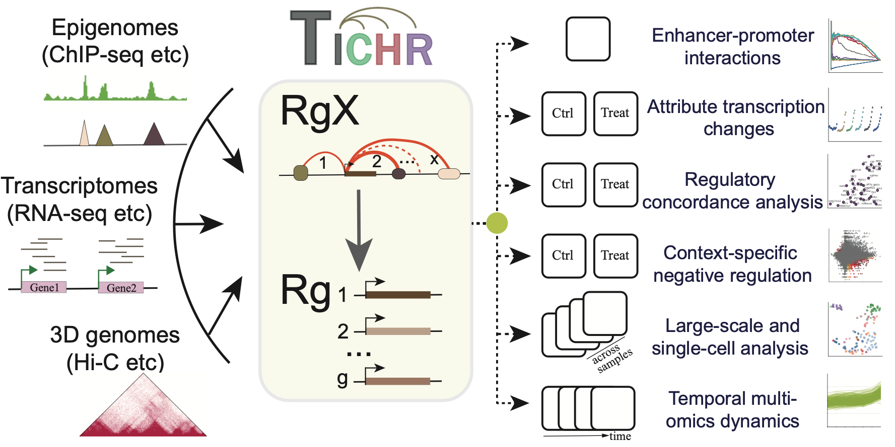

.. tichr documentation master file, created by
   sphinx-quickstart on Mon May 26 17:48:22 2025.
   You can adapt this file completely to your liking, but it should at least
   contain the root `toctree` directive.

Welcome to TICHR's documentation!
=================================

.. toctree::
   :maxdepth: 2
   :caption: Contents:

   0.Introduction
   1.Compute
   CLI
   2.EP
   3.DEG
   4.Treatment
   5.Negative
   6.Large
   7.Time
   ChangeLog
   License
   Contact
