# DEG analysis by Rg and RgX

## Identify related genes and functional elements in a comparison

The purpose of this analysis if for identifying the involved genes and elements that are related to specific treatment. Therefor, two sets of multiomics data is required.

### Prepare package and data

``` python
import sys
sys.path.append('/home/wang/github/Tichr-CLI/tichr')
from identifyGeneEP import *

Rgdir='/home/wang/Tichr/2024Oct-summary/ContextSpecific/RPE_siNIPBL_denovo/resultdf_all_hic/'
RgDF_Ctrl_file = Rgdir+"Control_H3K27ac_rep0_RP_RgDf.tsv"
RgxDF_Ctrl_file = Rgdir+"Control_H3K27ac_rep0_RP_RgxDf.tsv"
RgDF_Treat_file = Rgdir+"siNIPBL_H3K27ac_rep0_RP_RgDf.tsv"
RgxDF_Treat_file = Rgdir+"siNIPBL_H3K27ac_rep0_RP_RgxDf.tsv"

```

File requirement for RgDf
- column1: gene chr
- column2: gene star
- column3: gene end
- column4: gene ID
- column5: gene symbol
- column6: gene strand
- column7: gene Fold change
- column8: gene FDR
- column9: gene TPM (average of treat and ctrl)
- column10: gene Rg score

File requirment for RgxDf
- column1: site chr
- column2: site start
- column3: site end
- column4: site epigenome signal
- column5: gene ID
- column6: gene chr
- column7: gene start
- column8: gene end
- column9: gene strand
- column10: gene symbol
- column11: site-to-gene weight
- column12: Rgx score
- column13: Rgx ratio


###  predict DEGs based on Rg value of different top selected genes

selectGeneType could be: `rg, epi, 3d, fcrg, fcepi, fc3d`

The main purpose is to validate if the DEGs is related to epi, or 3d, or both (rg)


``` python
diffobj = DiffEvent(RgDF_Ctrl_file,RgxDF_Ctrl_file,RgDF_Treat_file,RgxDF_Treat_file)
diffobj.quantilePRC(selectGeneType="rg",label="select_rg",plotbg=True)
```

The following are output:
- PRC of predict DEGs by Rg value, under different threshold of top quantile genes by the `selectGeneType` parameter.
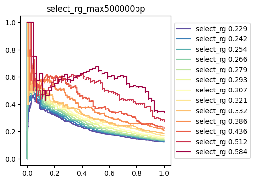

- PRC of predict DEGs by Rg value, using correponding random genes.
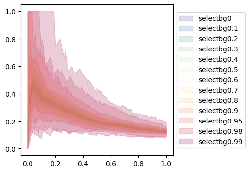

- AUPRC of selected genes prediction and random gene predictions.
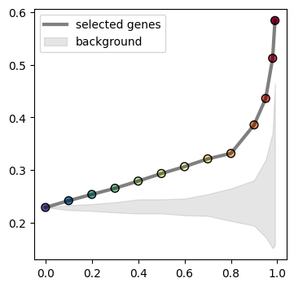


### fix a quantile threshold, and show the comparison of selected genes and random genes
The main purpose is to validate if the DEGs is related to epi, or 3d, or both (rg)


``` python
diffobj.selectgene(selectGeneType="rg",label="select_rg",
                   threshhold=0.9,plot=True,plotbg=True)
```

The following are output:
- PRC curve of selected genes and random genes
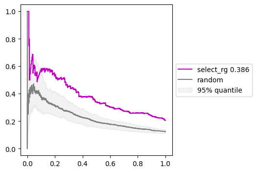

- statistical comparison of selected genes and random genes
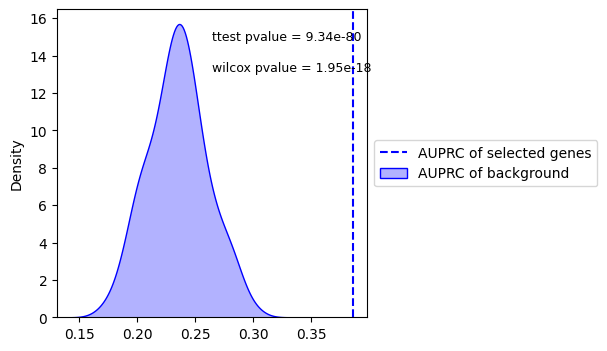

### selected the related genes by multiple critrias 

The main purpose is to output the related genes if they are related to the DEGs in the comparisons

- selectGeneType (`rg, epi, 3d, fcrg, fcepi, fc3d`),selectQuantile, quantiTh: select top changed Rg
- selectDeg: focus degs
- selectFc,fcTh: select foldchange of Rg > fcTh
- selectRank, sameTh, diffTh: select same or different trends between gene FC and gene Rg

``` python
diffobj.diffgene(selectGeneType="rg",quantiTh=0.8,selectQuantile=True,
                selectDeg=True,selectFc=False,fcTh=0.2,
                selectRank="same",sameTh=0.8,diffTh=0.8,)
```

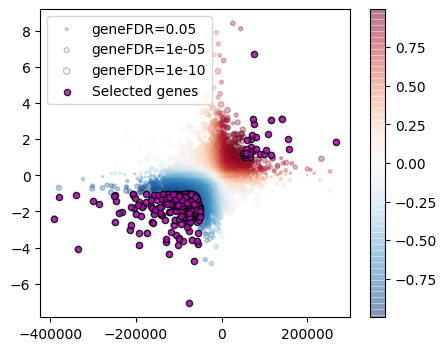

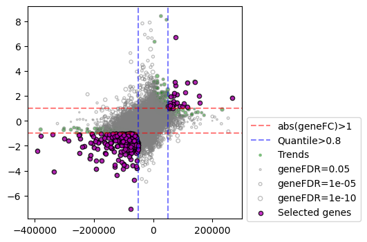


### selected the related functional sites by multiple critrias 

The main purpose is to output the related sites if they are related to the DEGs in the comparisons

- selectdiffgene: use the selected gened mentioned above
- selectRgxRatio, RgxRatioCut: select major Rgx for each gene by Rgx ratio > RgxRatioCut (default 0.01)
- selectRgxType (`rgx,epix,3dx,rgxpercent,fcepix,fc3dx,fcrgx`),selectRgxQuantile, quantileRgxCut: select top changed RgX
- selectRgxFold, RgxFcCut: elect foldchange of Rgx > RgxFcCut
- selectRgxRank, rgxRankCut: select same or different trends between gene FC and Rgx FC

``` python
diffobj.diffEP(selectdiffgene=True,selectRgxType="rgxpercent",
               selectRgxQuantile=True,quantileRgxCut=0.8,
               selectRgxFold =True,RgxFcCut=0.5,selectRgxRank = "same",rgxRankCut=0.8)
```


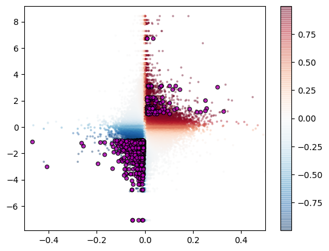

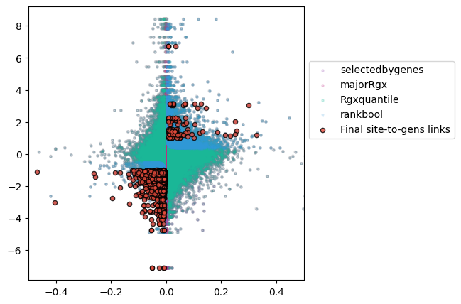


## Study the most related factors in a comparison

In other words, use multiple types of epigenomes to predict DEGs

### Prepare data

``` python
Rgdir="/home/wang/Tichr/2024Oct-summary/ContextSpecific/EPSC_shYY1_denovo/resultdf_shYY1_hic/"

pair_list = [
    ["ATAC-seq_EPSC_shYy1_None_rep1_RP","ATAC-seq_EPSC_shCtrl_None_rep1_RP",],
    ["ATAC-seq_EPSC_shYy1_None_rep2_RP","ATAC-seq_EPSC_shCtrl_None_rep2_RP"],
    ["ChIP-Seq_EPSC_shYy1_CTCF_rep0_RP", "ChIP-Seq_EPSC_shCtrl_CTCF_rep0_RP", ],
    ["ChIP-Seq_EPSC_shYy1_H3K4me3_rep0_RP","ChIP-Seq_EPSC_shCtrl_H3K4me3_rep0_RP",],
    ["CUTTAG_EPSC_shYy1_H3K27ac_rep0_RP","CUTTAG_EPSC_shCtrl_H3K27ac_rep0_RP", ],
]
namelist = ["ATAC_rep1","ATAC_rep2","CTCF_rep0","H3K4me3_rep0","H3K27ac_rep0"]
```

The folder need to contain the standard RgDf file for all samples, with "_RgDf.tsv" as ending. If  `maxdistance` is assigned, the corresponding RgX file need to be in the same folder as "_RgxDf.tsv".


### Predict DEGs with multiple types of epigenomes

showTF, showName: Select one typical epigenomic signal, use only that to predict DEGs. This will prove the goodness of using multiple epigenomic tracks.
maxdistance: use the maxdistance Rgx to re-caluculate Rg


``` python

obj = manyTFpredict(Rgdir,pair_list,namelist,maxdistance=500000)

suptitle = "(HiC 500k)"
obj.makemodel()
obj.plotresult(showTF="H3K27ac_rep0",showName="H3K27ac_rep0 Only",suptitle=suptitle)

obj.makemodel("up")
obj.plotresult(showTF="H3K27ac_rep0",showName="H3K27ac_rep0 Only",suptitle=suptitle)

obj.makemodel("down")
obj.plotresult(showTF="H3K27ac_rep0",showName="H3K27ac_rep0 Only",suptitle=suptitle)

```

This will output the following results.

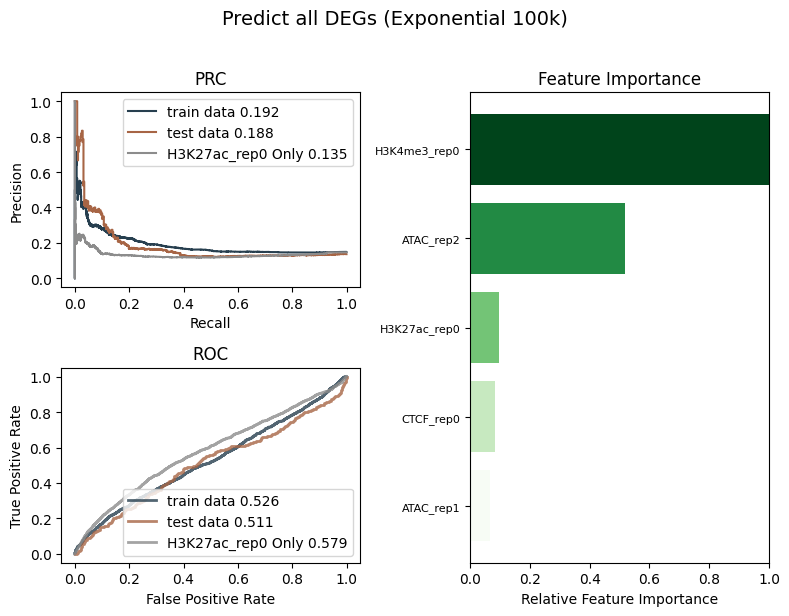

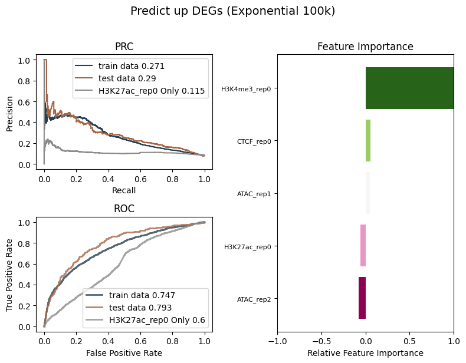

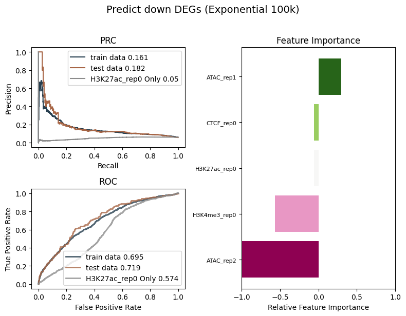